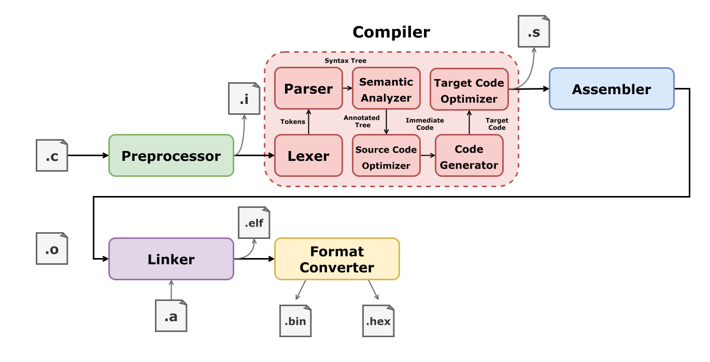
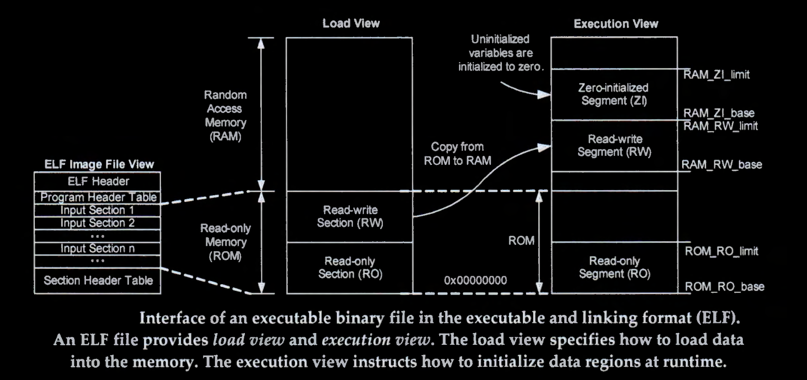
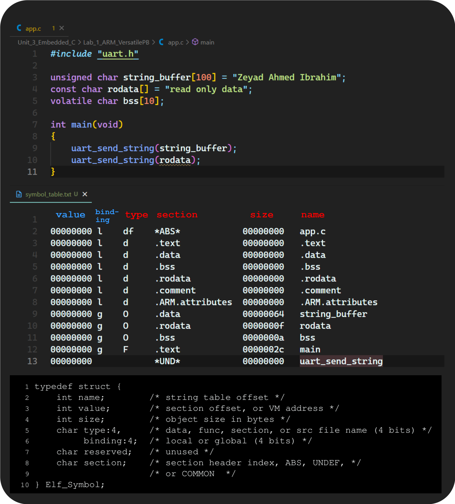
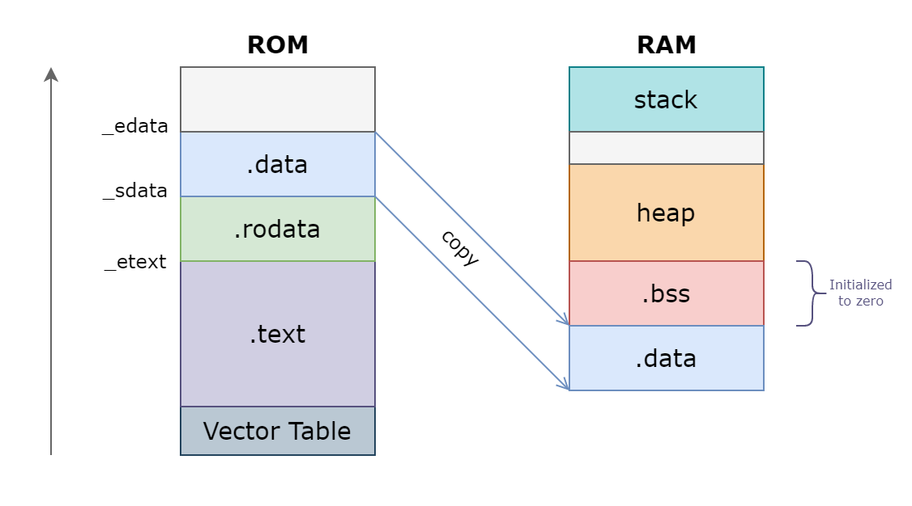
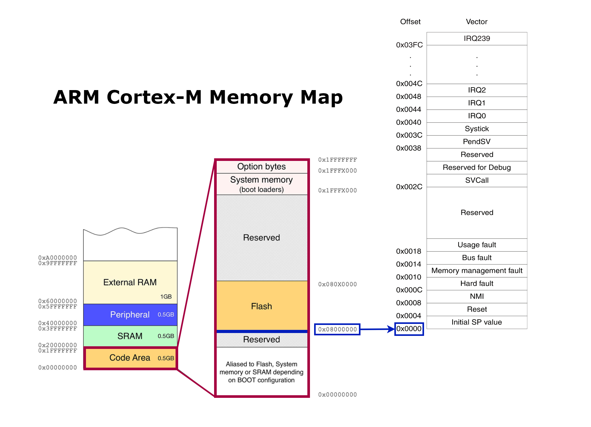
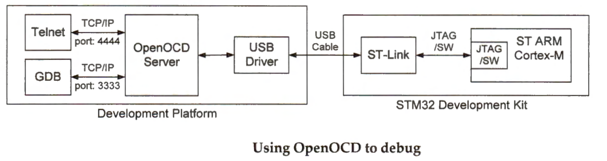

## Cross-Compilation Toolchain

* `arm-none-eabi-gcc`     : Compiler, linker and assembler (Compiler Driver).
* `arm-none-eabi-as`      : Assembler
* `arm-none-eabi-ld`      : Linker
* `arm-none-eabi-objcopy` : Format converter
* `arm-none-eabi-objdump` : Display information from object files
* `arm-none-eabi-readelf` : Display information about ELF files
* `arm-none-eabi-nm`      : List symbols from object files

* **Note :**
    * `arm` : Architecture
    * `none` : No OS
    * `eabi` : Embedded Application Binary Interface
        * An embedded-application binary interface (EABI) specifies standard conventions for file formats, data types, register usage, stack frame organization, and function parameter passing of an embedded software program, so that object files generated from one compiler is compatible with object files generated from another compiler.
  

## Compiler Flags

|Flag|Meaning|
|:---:|:---:|
|`-B <directory>`| Add `<directory>` to the compiler's search paths.|
|`-v`|Display the programs invoked by the compiler.|
|`-E`|Preprocess only; do not compile, assemble or link.|
|`-S`|Compile only; do not assemble or link.|
|`-c`|Compile and assemble, but do not link.|
|`-o <file>`|Place the output into `<file>`.|
|`-save-temps`|Do not delete intermediate files.|
|`-time`|Time the execution of each subprocess.|
|`-std=<standard>`|Assume that the input sources are for `<standard>`.|
|`-march=<arch name>`|Specify the name of the target architecture.|
|`-mcpu=<cpu name>`|Specify the name of the target CPU, architecture is derived|
|`-mtune=`|Tune code for the given processor.|
|`-O<level>`|Optimization Level {0,1,2,3,s,fast,g}|
|`-g`|Produce debugging information|
|`-ggdb`|Produce debugging information for use by GDB.|
|`-gdwarf-2`|Produce debugging information in DWARF format.|
|`-I <dir>`| Add the directory `dir` to the head of the list of directories to be searched for header files.|
|`-L <dir>`|Add directory `dir` to the list of directories to be searched for `-l`|
|`-l<library>`|Search the library named `library` when linking.|
|`-nostartfiles`|Do not use the standard system startup files when linking.|
|`-nostdlib`|Do not use the standard system startup files or libraries when linking.|
|`-fno-builtin`|Disable all replacement and inlining of standard C functions with equivalents.|
|`-ffreestanding`|Prevents the compiler from making optimizations based on assumptions about the behaviors of the standard libraries|
|`-Wl,<option>`| Pass `option` as an option to the linker.|

## Compilation Process

<div style="border-radius: 30px; overflow: hidden;">
    <p align="center">
        
    </p>
</div>

## ELF Format

* **ELF** : Executable and Linkable Format
  * ELF is a standard file format for object and executable files.
  * It contains information on how to load your program into memory or link with other object files to form an executable object
* A file format standard describes a way of organizing various elements (data, read-only data, code, uninitialized data,etc.) of a program in different sections.

* **ELF provides two interfaces to binary files :**
    * **Linkable Interface :** is used at static link time to combine multiple files when compiling and building a program.
    * **Executable Interface :** is utilized at runtime to create a process image in memory when a program is loaded into memory and then executed.
    
<div style="border-radius: 30px; overflow: hidden;">
    <p align="center">
        
    </p>
</div>

* **The Executable Interface Provides Two Separate Logic Views :** 
    * **Load view :** classifies the input sections into two regions: read-write section and read-only section.
        * The load view also defines the base memory address of these regions so that the processor knows where it should load them into the memory.
    * **Execution view :** informs the processor how to load the executable at runtime. 


<p align="center">
  
</p>


**A typical ELF relocatable object file contains the following sections:**

* `.text` : The machine code of the compiled program.
* `.rodata` : Read-only data 
* `.data` : Initialized global C variables.
  * Local C variables are maintained at run time on the stack, and do not appear in either the `.data` or `.bss` sections.
* `.bss` : Uninitialized global C variables.
  * This section occupies no actual space in the object file; it is merely a place holder.
  * Object file formats distinguish between initialized and uninitialized variables for space efficiency
  * uninitialized variables do not have to occupy any actual disk space in the object file.
* `.symtab` : A symbol table with information about functions and global variables that are defined and referenced in the program.
* `.rel.text` : A list of locations in the `.text` section that will need to be modified when the linker combines this object file with others.
    * In general, any instruction that calls an external function or references a global variable will need to be modified.
* `.rel.data` : Relocation information for any global variables that are referenced or defined by the module.
* `.debug` : A debugging symbol table with entries for local variables and typedefs defined in the program, global variables defined and referenced in the program, and the original C source file.
    * It is only present if the compiler driver is invoked with the `-g` option.
* `.line` : A mapping between line numbers in the original C source program and machine code instructions in the `.text` section.
    * It is only present if the compiler driver is invoked with the `-g` option.
* `.strtab` : A string table for the symbol tables in the `.symtab` and `.debug` sections, and for the section names in the section headers.
    * A string table is a sequence of null-terminated character strings.

## Relocatable object files
* Compilers and assemblers generate **relocatable object files**.
    * which are object files that contains binary code and data in a form that can be combined with other relocatable object files at compile time to create an executable object file.
* Object file formats vary from system to system.
    * The first Unix systems `.out`
    * Windows NT `PE`
    * Modern Unix systems `elf` -> `.o`

* `.o` files contains machine specific code and data of the program
  * it doesnt contain any absolute addresses.
* `arm-none-eabi-objdump` : display information from object files

### Objdump Flags

|Flag|Meaning|
|:---:|:---:|
|`-h`|Display the contents of the section headers|
|`-x`|Display the contents of all headers|
|`-d`|Display assembler contents of executable sections|
|`-D`|Display assembler contents of all sections|
|`-S`|Intermix source code with disassembly|
|`-t`|Display the contents of the symbol table|
|`-l`|Include line numbers and filenames in output|


```c
#include "uart.h"

unsigned char string_buffer[100] = "Zeyad Ahmed Ibrahim"; // .data
const char rodata[] = "read only data";                   // .rodata

void main(void)
{
    uart_send_string(string_buffer);
}
```


<p align="center">
  
</p>


<div style="border-radius: 30px; overflow: hidden;">
    <p align="center">
        
    </p>
</div>

* `ALLOC` – Section will have space allocated in the process when loaded.
  *  Set for all sections except those containing debug information.
* `LOAD` – Section will be loaded from the file into the child process memory.
  * Set for pre-initialized code and data, clear for .bss sections.
* `RELOC` – Section needs to be relocated before loading.
* `READONLY` – Section cannot be modified by the child process.
* `CODE` – Section contains executable code only.
* `DATA` – Section contains data only (no executable code).

### Object file symbols

<div style="border-radius: 30px; overflow: hidden;">
    <p align="center">
        
    </p>
</div>

* `T` : The symbol is in the text (code) section.
* `D` : The symbol is in the initialized data section.
* `U` : The symbol is undefined.

---

### Symbols and Symbol Tables

* Each relocatable object file has a symbol table that contains information about the symbols that are defined and referenced by it
    * **Global defined symbols :** defined by module and can be reference by other modules (nonstatic C functions and non-static global variables)
    * **Global referenced symbols :** defined by some other module and referenced inside your module (externals).
    * **Local symbols :** defined and referenced exclusively by the module and cannot be referenced by other modules (C functions and global variables that are defined with the static attribute.)
* An ELF symbol table is contained in the `.symtab` section. 


* There are three special pseudo-sections that don’t have entries in the section header table:
    * `ABS` is for symbols that should not be relocated.
    * `UNDEF` is for undefined symbols, that is, symbols that are referenced in this object module but defined elsewhere.
    * `COMMON` is for uninitialized data objects that are not yet allocated.

| Symbol | Description                                                            |
|--------|------------------------------------------------------------------------|
| `l`    | The symbol is local.                                                   |
| `g`    | The symbol is global.                                                  |
| `u`    | The symbol is a unique global.                                         |
| `!`    | The symbol is both global and local.                                   |
| `w`    | The symbol is weak.                                                    |
| `C`    | The symbol denotes a constructor.                                      |
| `W`    | The symbol is a warning.                                               |
| `I`    | The symbol is an indirect reference to another symbol.                 |
| `i`    | The symbol is a function to be evaluated during relocation processing. |
| `d`    | The symbol is a debugging symbol.                                      |
| `D`    | The symbol is a dynamic symbol.                                        |
| `F`    | The symbol is the name of a function.                                  |
| `f`    | The symbol is the name of a file.                                      |
| `O`    | The symbol is the name of an object.                                   |

<p align="center">
  
</p>


### Symbol Resolution
* The linker resolves symbol references by associating each reference with exactly one symbol definition from the symbol tables of its input relocatable object files
*  When the compiler encounters a symbol (either a variable or function name) that is not defined in the current module, it assumes that it is defined in some other module, generates a linker symbol table entry, and leaves it for the linker to handle.
* If the linker is unable to find a definition for the referenced symbol in any of its input modules, it prints an error message and terminates.

* At compile time, the compiler exports each global symbol to the assembler as either strong or weak, and the
assembler encodes this information implicitly in the symbol table of the relocatable object file.
* Functions and initialized global variables get strong symbols. Uninitialized global variables get weak symbols.
* **For multiply-defined symbols :**
    * Multiple strong symbols are not allowed.
    *  Given a strong symbol and multiple weak symbols, choose the strong symbol.
    *  Given multiple weak symbols, choose any of the weak symbols.
* Invoke the linker with a flag such as the GCC `-warn-common` flag, which instructs it to print a warning message
when it resolves multiply-defined global symbol definitions.

---

## Start-up File

* Startup file is responsible for setting up the enviroment for the main user code to run.
    * Code written in startup file runs before `main()`.
    * Some parts of the startup code is target dependent.
* **Startup code takes care of :**
  * Vector table placement.
  * Stack reinitialization.
* Startup code is responsible of `.data` , `.bss` section initialization in main memory
  * Copy `.data` section to RAM.
  * Initialize the `.bss` section to zero in RAM.

<div style="border-radius: 30px; overflow: hidden;">
    <p align="center">
        
    </p>
</div>

* Section boundary information and sizes need to be exported from a **linker script** to the startup file.

### Functional Attribute
* In GNU C and C++, you can use function attributes to specify certain function properties that may help the compiler optimize calls or check code more carefully for correctness. 
* You can also use attributes to control memory placement, code generation options or call/return conventions within the function being annotated.
* Many of these attributes are target-specific.
  * However, a considerable number of attributes are supported by most, if not all targets.
* Function attributes are introduced by the `__attribute__` keyword in the declaration of a function, followed by an attribute specification enclosed in double parentheses.

#### Common Function Attributes

* `section ("section-name")`
  * Normally, the compiler places the code it generates in the text section. Sometimes, however, you need additional sections, or you need certain particular functions to appear in special sections. 
  * The section attribute specifies that a function lives in a particular section. 
* `weak`
  * The weak attribute causes a declaration of an external symbol to be emitted as a weak symbol rather than a global.
  * This is primarily useful in defining library functions that can be overridden in user code
  * The overriding symbol must have the same type as the weak symbol.
  * In addition, if it designates a variable it must also have the same size and alignment as the weak symbol.
* `alias ("target")`
  * The alias attribute causes the declaration to be emitted as an alias for another symbol, which must have been previously declared with the same type, and for variables, also the same size and alignment.
* `aligned (alignment)`
  * The aligned attribute specifies a minimum alignment for the first instruction of the function, measured in bytes.
  * When specified, alignment must be an integer constant power of 2.
  * Specifying no alignment argument implies the ideal alignment for the target.

--- 

### Vector Table (ARM Cortex-M Case Study)

* The vector table is a section of our flash memory that mostly holds the addresses of various handlers.
    * Starting address of the **reset handler** (Reset handler is the code executed on reset)
    * Starting addresses of all other exceptions and interrupts including the NMI handler, Hard fault handler and so on.

* The interrupt vector table is called "vector" because it holds addresses (pointers) to interrupt service routines (ISRs). 
	* When an interrupt occurs, the processor uses the interrupt number to vector (direct) to the appropriate ISR via the table.

<p align="center">
  
</p>

* Memory map of the 4GB memory space in a Cortex-M3 microprocessor, Within this 4GB linear memory space, the address range of instruction memory, data memory, internal and external peripheral devices, and external RAM has no overlap with each other.
    * The on-chip flash memory, used for the instruction memory, has 4 KB, and its address starts at `0x0800_0000`.
    * The on-chip SRAM, used for the data memory, has 256 KB, and its memory address begins at `0x2000_0000`.
    * The external RAM allows the processor to expand the data memory capacity.


<p align="center">
  
</p>


* The interrupt vector table is relocatable. 
	* While the interrupt vector table is located at the memory address `0x0000_0004`, this low memory address can be physically re-mapped to different regions, such as on-chip flash memory, on-chip RAM memory, or on-chip ROM memory.
	* This allows the processor to boot from various memory regions.

* On many STM32 families, the boot address in the internal flash is `0x0800_0000`.
  *  This address is remapped to address `0x0000_0000` by boot mode mechanism. 

<p align="center">
  
</p>


* **Boot Sequence :**
  * Take the initial value of the Main stack pointer from the address `0x0000` (`0x0800_0000`) so we store in this location the SRAM address
  * Take the value of the program counter from the address `0x0004` (Reset_Handler).
  * Continue execution from the address corresponding to this value. 

<p align="center">
  
</p>

```ARM
.section .vectors

.word   0x20001000    /* Stack top (SRAM) */
.word   _RESET        
.word   _NMI         
.word   _HARD_FAULT   
.word   _MEM_MGMT_FAULT     
.word   _BUS_FAULT    
.word   _USAGE_FAULT  
.word   _RESERVED
.word   _RESERVED
.word   _RESERVED
.word   _RESERVED
.word   _SVCALL
.word   _RESERVED_DBG
.word   _RESERVED
.word   _PENDSV
.word   _SYSTICK
.word   _IRQ_0
.word   _IRQ_1
/* ....................... */
.word   _IRQ_
```

* **Startup in C**
  * As (Cortex-M3) can initialize the stack pointer with the first 4 bytes, we can write startup code completely in C.

<table>
<tr>
<th> Basic </th>
<th> Using Weak and Alias Attributes </th>
</tr>
<tr>
<td>

```c
#define STACK_TOP 0x20001000

extern int main(void);

void Reset_Handler(void)
{
    main();
}

void NMI_Handler(void)
{
    Reset_Handler();
}
void Hard_Fault_Handler(void)
{
    Reset_Handler();
}

uint32 vectors[] __attribute__((section(".vectors"))) = {
    STACK_TOP,
    (uint32) &Reset_Handler,
    (uint32) &NMI_Handler,
    (uint32) &Hard_Fault_Handler
};
```

</td>
<td>

```c
#define STACK_TOP 0x20001000

extern int main(void);

void Reset_Handler(void);

void Default_Handler()
{
    Reset_Handler();
}

void NMI_Handler(void) __attribute__ ((weak,alias("Default_Handler")));
void Hard_Fault_Handler(void) __attribute__ ((weak,alias("Default_Handler")));

uint32 vectors[] __attribute__((section(".vectors"))) = {
    STACK_TOP,
    (uint32) &Reset_Handler,
    (uint32) &NMI_Handler,
    (uint32) &Hard_Fault_Handler,
};

void Reset_Handler(void)
{
    main();
}
```

</td>
</tr>
</table>


<p align="center">
  
</p>


## Initialize Memory

```c
void Mem_Init(void)
{
    extern uint32 _S_DATA;
    extern uint32 _E_DATA;
    extern uint32 _S_BSS;
    extern uint32 _E_BSS;
    extern uint32 _E_TEXT;

    /********* Copy from FLASH to SRAM *********/

    uint32 size_data = (uint32)&_E_DATA - (uint32)&_S_DATA;

    byte *dst = (byte *)(&_S_DATA); // SRAM
    byte *src = (byte *)(&_E_TEXT); // FLASH

    for(uint32 i = 0; i < size_data; i++){
        *dst++ = *src++;
    }
    
    /**************** Zero BSS ****************/

    uint32 size_bss = (uint32)&_E_BSS - (uint32)&_S_BSS;

    dst = (byte *)&_S_BSS;

    for(uint32 i = 0; i<size_bss; i++){
        *dst++ = (byte)0;
    }
}
```

<p align="center">
  
</p>


---

## Linker Script

* Linker script is a text file which explains how different sections of the object files should be merged to create an output file.
* Linker and locator assign absolute addresses to different section of the output file by referring to address information mentioned in the linker script.
* Linker script also includes the code and data memory address and size information.
* Linker scripts are written using the GNU Linker command Language and has the file extension `.ld`.
* Linker scripts are typically invoked via the use of the `-T script.ld` command line argument when calling the `ld` application.

**A linker script contains four things:**

* **Memory layout:** what memory is available where
* **Section definitions:** what part of a program should go where
* **Options:** commands to specify architecture, entry point, …etc. if needed
* **Symbols:** variables to inject into the program at link time

### Linker Script Commands

|Command|Meaning|
|:---:|:---:|
|`ENTRY`|command specifically for defining the first executable instruction in an output file (its entry point).|
|`MEMORY`|describes the location and size of blocks of memory in the target.|
|`SECTIONS`|controls exactly where input sections are placed into output sections, their order in the output file, and to which output sections they are allocated.|


* `ENTRY(symbol)` 

```
MEMORY 
  {
    name (attr) : ORIGIN = origin, LENGTH = len
    ...
  }
```

* `MEMORY`: you can describe which memory regions may be used by the linker, and which memory regions it must avoid.
  * `attr` define the optional attribute list of the memory region, these attributes are meant to describe the properties of the memory, not set it.
  * `name` is a name used internally by the linker to refer to the region.
  * `origin` is the start address of the region in physical memory.
  * `len` is the size in bytes of the region (an expression). 

```
MEMORY
{
  rom  (rx)  : ORIGIN = 0x00000000, LENGTH = 0x00040000
  ram  (rwx) : ORIGIN = 0x20000000, LENGTH = 0x00008000
}
```


|attr|Meaning|
|:---:|:---:|
|`R`|Read-only sections.|
|`W`|Read/write sections.|
|`X`|Sections containing executable code.|
|`A`|Allocated sections.|
|`I`|Initialized sections.|

```
SECTIONS { ...
  secname : {
    contents
  }
... }
```
* `SECTION` specifies the properties of an output section.
  * its location, alignment, contents, fill pattern, and target memory region.
  * The linker will not create output sections which do not have any contents. 
  * `secname` must meet the constraints of your output format.

* You typically want to put symbols in the same section if:
    * They should be in the same region of memory
    * They need to be initialized together.

* In the following example, the command script arranges the output file into three consecutive sections, named `.text`, `.data`, and `.bss`, taking the input for each from the correspondingly named sections of all the input files:
    * `<filename>(<section>)` : input sections from following files , `*` represents all files.


```
SECTIONS { 
  .text : 
  {
    *(.text)                   // merge .text section of all input files
    *(.rodata)
  }>(vma) AT > (lma)

  .data :
  {
    *(.data) 
  }>ram AT > flash

  .bss :
  {
    *(.bss)
    *(COMMON)  // special input section where the compiler puts global uninitialized variables that go beyond file scope.
  }>ram 
}
```

* Every section in our linker script has two addresses, its load address (LMA) and its virtual address (VMA).
    * In a firmware context, the LMA is where your JTAG loader needs to place the section and the VMA is where the section is found during execution.

* `AT (ldadr)` The expression `ldadr` that follows the `AT` keyword specifies the load address of the section. 
* `>region` Assign this section to a previously defined region of memory. 
* `LOADADDR(section)` Return the absolute load address of the named section.
* `SIZEOF(section)` Return the size in bytes of the named section, if that section has been allocated.

* **Location Counter :** The special linker variable dot `.` always contains the current output location counter. 
  * it must always appear in an expression within a `SECTIONS` command. 
  * Assigning a value to the `.` symbol will cause the location counter to be moved.
    * This may be used to create holes in the output section.
  * The location counter **cannot** moved backwards.
  * You can use this symbol inside the linker script to track and define boundaries of various sections.

* `ALIGN(exp)` Return the result of the current location counter `.` aligned to the next `exp` boundary.
  *  `exp` must be an expression whose value is a power of two. 

* `KEEP(section)` instruct the linker to keep the specified section, even if no symbols inside it are referenced.
    * relevant when garbage collection is performed at link time, enabled by passing the` --gc-sections` switch to the linker.

```
SECTIONS
{
  output :
  {
  . = 0x10000;  
  file1(.text)
  . = . + 1000;
  file2(.text)
  . += 1000;
  file3(.text)
  } = 0x1234;
}
```

### Linker Script symbols
* A symbol is the name of an address
* In order to make section addresses available to code, the linker is able to generate symbols and add them to the program.
    * you must use a reference to them, never the variable themselves. 
* a linker script symbol is not equivalent to a variable declaration in a high level language, it is instead a symbol that does not have a value.
* Linker scripts symbol declarations, create an entry in the symbol table but do not assign any memory to them. Thus they are an address without a value. 
    * Hence when you are using a linker script defined symbol in source code you should always take the address of the symbol, and never attempt to use its value.

<table>
<tr>
<th> Defining Linker script symbols </th>
<th> Using Linker script symbols in code</th>
</tr>
<tr>
<td>

```ld
SECTIONS
{
    .text : 
    {
        *(.vectors*)
        *(.text*)
        *(.rodata)
        _E_TEXT = . ;
    } > FLASH

    .data :
    {
        _S_DATA = . ;
        *(.data)
        _E_DATA = . ;
    }>SRAM AT> FLASH

    .bss :
    {
        _S_BSS = . ;
        *(.bss)
        . = ALIGN(4);
        _E_BSS = . ;

        . = ALIGN(4);
        . = . + 0x1000 ;
        _STACK_TOP = . ;
        
    }>SRAM
}
```

</td>
<td>

```c
void Mem_Init(void)
{
    extern uint32 _S_DATA;
    extern uint32 _E_DATA;
    extern uint32 _S_BSS;
    extern uint32 _E_BSS;
    extern uint32 _E_TEXT;

    /********* Copy from FLASH to SRAM *********/

    uint32 size_data = (uint32)&_E_DATA - (uint32)&_S_DATA;

    byte *dst = (byte *)(&_S_DATA); // SRAM
    byte *src = (byte *)(&_E_TEXT); // FLASH

    for(uint32 i = 0; i<size_data; i++){
        *dst++ = *src++;
    }
    
    /**************** Zero BSS ****************/

    uint32 size_bss = (uint32)&_E_BSS - (uint32)&_S_BSS;

    dst = (byte *)&_S_BSS;

    for(uint32 i = 0; i<size_bss; i++){
        *dst++ = (byte)0;
    }

}

```

</td>
</tr>
</table>

## Case Study (STM32)

```ld
MEMORY
{
    FLASH(RX) : ORIGIN = 0x08000000, LENGTH = 128k
    SRAM(RWX) : ORIGIN = 0x20000000, LENGTH = 20k
}

STACK_SIZE = 0x1000;

SECTIONS
{
    .text : 
    {
        *(.vectors*)
        *(.text*)
        *(.rodata)
        _E_TEXT = . ;
    } > FLASH

    .data :
    {
        _S_DATA = . ;
        *(.data)
        _E_DATA = . ;
    }>SRAM AT > FLASH

    .bss :
    {
        _S_BSS = . ;
        *(.bss)
        *(COMMON)
        . = ALIGN(4);
        _E_BSS = . ;
        // Reserve Space for stack
        // Should be aligned on an 8-byte boundary (AAPCS)
        . = ALIGN(8);
        . = . + STACK_SIZE ;
        . = ALIGN(8);
        _STACK_TOP = . ;
    }>SRAM
}
```

<p align="center">
  
</p>


## Linking

* `arm-none-eabi-ld`      : Linker

|Flag|Meaning|
|:---:|:---:|
|`-T script`|Use script as the linker script.|
|`-nostdlib`|Do not use the standard system startup files or libraries when linking.|
|`-Map=<file.map>`|Write a linker map to `<file>`|
|`--gc-section`|The linker can perform the dead code elimination doing a garbage collection of code and data never referenced.|
|`--warn-common`|Warn when a common symbol is combined with another common symbol|

* Linking is the process of collecting and combining the various pieces of code and data that a program needs in order to be loaded (copied) into memory and executed. 
* Linkers play a crucial role in software development because they enable separate compilation.
  * Instead of organizing a large application as one source file, we can decompose it into smaller, more manageable modules that can be modified and compiled separately.
  * When we change one of these modules, we simply recompile it and relink the application, without having to recompile the other files.
* Linker program take as input a collection of relocatable object files and command line arguments and generate as output a fully linked executable object file that can be loaded and run.
  * The input relocatable object files consist of various code and data sections.
  * Instructions are in one section (`.text`), initialized global variables are in another section (`.data`), and uninitialized variables are in yet another section (`.bss`).
* To build the executable, the linker must perform two main tasks:
  * **Symbol resolution :** Object files define and reference symbols.
    * The purpose of symbol resolution is to associate each symbol reference with exactly one symbol definition.
  * **Relocation :** Compilers and assemblers generate code and data sections that start at address zero.
    * The linker relocates these sections by associating a memory location with each symbol definition, and then modifying all of the references to those symbols so that they point to this memory location.
* A linker concatenates blocks together, decides on run-time locations for the concatenated blocks, and modifies various locations within the code and data blocks. 

<div style="border-radius: 30px; overflow: hidden;">
    <p align="center">
        
    </p>
</div>

### Final Executable Symbol Table

<div style="border-radius: 30px; overflow: hidden;">
    <p align="center">
        
    </p>
</div>

---

## Integrating C Standard Library

* **Newlib** is a C standard library implementation intended for use on embedded systems.
  * Newlib is included in the GNU Arm toolchain, **nano** is a smaller implementation optimized for "small" embedded applications it focuses on code and data size reduction through optimization and removal of non-MCU features.

<p align="center">
  
</p>

* Newlib implements the hardware independent parts of the C library and rely on a few low-level system calls that must be implemented with the target hardware in mind
  * when using newlib you must implement the system calls appropriately to support devices, file-systems, and memory management.

* **Complete List :**
```
_exit, _close, environ, execve, fork, fstat, getpid, isatty, kill, link, lseek, open, read, _sbrk, stat, times, unlink, wait, write
```
* several of the syscalls relate to filesystem operation or process control.
  *  These do not make much sense in a firmware context, so we’ll often simply provide a stub that returns an error code.

* **Most Important syscalls :**

|System Call|Meaning|
|:---:|:---:|
|`sbrk_`|Increase program data space,`malloc` and related functions depend on this|
|`write_`|Write to a file. libc subroutines will use this system routine for output to all files, including stdout|
|`read_`|Read from a file.|

* `brk` and `sbrk` are basic memory management system calls used in Unix and Unix-like operating systems to control the amount of memory allocated to the data segment of the process.
  * The `brk` and `sbrk` calls dynamically change the amount of space allocated for the **data** segment of the calling process.
  *  The change is made by resetting the **program break** (brk) of the process, which determines the maximum space that can be allocated.
  *  The **program break** is the address of the first location beyond the current end of the data region.
  * `sbrk(intptr_t increment)` increments the program's data space by `increment` bytes.
  *  These functions are typically called from a higher-level memory management library function such as `malloc`.

<p align="center">
  
</p>

* In GCC, you can create a spec file *-using the `-specs=` option-* containing compiler options and settings.
  *  This option allows you to encapsulate a set of compiler and linker options in a single file, which can make it more convenient to manage complex build configurations.
  * We will use `--specs=nano.specs` to configure linking the newlib nano library.


---

# Makefile

### Dependency Graph

<p align="center">
  
</p>

### Rules
* **Target :** Files you want to build.
* **Dependencies :** File that is used as input to create the **Target**.
* **Recipe :** Definition of how you go from a complete list of **Dependencies** to the given **Target**.
  * A recipe may have more than one command, either on the same line or each on its own line.
  * You **must** put a tab character at the beginning of every recipe line!

* You can format your makefiles for readability by adding newlines into the middle of a statement: you do this by escaping the internal newlines with a backslash `\` character.


```make
target … : prerequisites …
        recipe
        long-line \
        continue long line
        …
        …
```
* when you give the command `make` (with no arguments):
  * By default, `make` starts with the **first** target.
  * before `make` can fully process this rule, it must process the rules for the files that its target depends on.
  * Any rule that doesnt depend on the initial target wont run at all unless explicitly called with an argument to `make` command.
* `make` does its work in two distinct phases.
  * **First phase :** it reads all the makefiles, included makefiles, etc. and internalizes all the variables and their values and implicit and explicit rules, and builds a dependency graph of all the targets and their prerequisites.
    * Therefore order of rules is not significant, except for determining the default goal (First rule)
  * **Second phase :** `make` uses this internalized data to determine which targets need to be updated and run the recipes necessary to update them.
* **Variables :**
  * A variable is a name defined in a makefile to represent a string of text ( `foo=value` or `foo:=value` )
  * To substitute a variable’s value, write a dollar sign followed by the name of the variable in parentheses or braces: either `$(foo)` or `${foo}`

* **Automatic Variables**
  * `$@` The file name of the target of the rule.
  * `$^` list of all the prerequisites of the rule.
  * `$<` The name of the first prerequisite (for header files).

### Wildcards
* A single file name can specify many files using wildcard characters like (`*`, `?` and `[…]`)
    * `*` : represent any number of characters 
    * `?` : represent any single character.
    * `[]` : specifies a range.

*  Wildcard expansion does not happen when you define a variable.
   *  you must use the function `wildcard` 
   *  `objects := $(wildcard *.o)`

### VPATH and vpath
* The value of the make variable `VPATH` specifies a list of directories that make should search. Most often, the directories are expected to contain prerequisite files that are not in the current directory; however, make uses `VPATH` as a search list for both prerequisites and targets of rules.
  * `VPATH = src:../headers` specifies a path containing two directories, `src` and `../headers`
  * `foo.o : foo.c` is equivalent to `foo.o : src/foo.c`
* the `vpath` directive (note lower case), which allows you to specify a search path for a particular class of file names: those that match a particular pattern. 
  * `vpath %.h ../headers` tells make to look for any prerequisite whose name ends in .h in the directory ../headers if the file is not found in the current directory.

* **Pattern rule**
```
%.o: %.c
        $(CC) -c $^ -o $@ 
```
* It specifies one target and one dependency, and causes one invocation of `$(CC)` for each target. 
  * The `%` matches any nonempty string, and the other characters match themselves.
  * `%.c` as a pattern matches any file name that ends in `.c`
  * `%` in a prerequisite of a pattern rule stands for the same **stem** that was matched by the `%` in the target.

* When a line starts with `@`, the echoing of that line is suppressed.

* **Substitution References**
  * A substitution reference substitutes the value of a variable with alterations that you specify. 
  * `$(var:a=b)` : its meaning is to take the value of the variable `var`, replace every `a` at the end of a word with `b` in that value, and substitute the resulting string.
  * `a` must appear either followed by whitespace or at the end of the value in order to be replaced; other occurrences of a in the value are unaltered.

*  the `-j` option tells make to execute many recipes simultaneously.
   *  If the `-j` option is followed by an integer, this is the number of recipes to execute at once; 
   *  If a makefile completely and accurately defines the dependency relationships between all of its targets, then make will correctly build the goals regardless of whether parallel execution is enabled or not. 

### Useful functions
* Functions for String Substitution
  * `$(subst from,to,text)`
  * `$(patsubst pattern,replacement,text)`
  * `$(sort list)`

* We can change the list of C source files into a list of object files by replacing the ‘.c’ suffix with ‘.o’ in the result, like this:
  * `$(patsubst %.c,%.o,$(wildcard *.c))`
* `$(addsuffix suffix,names…)` The value of suffix is appended to the end of each individual name and the resulting larger names are concatenated with single spaces between them.
* `$(addprefix prefix,names…)` The value of prefix is prepended to the front of each individual name and the resulting larger names are concatenated with single spaces between them.
* `$(join list1,list2)` 
  * `$(join a b,.c .o)` produces ‘a.c b.o’
* `$(foreach var,list,text)`  It causes one piece of text to be used repeatedly, each time with a different substitution performed on it.
* `$(notdir $(filename))` takes away the path from the file name leaving just the file name`

## Tracking Header files 

* Compiler Options Controlling the Preprocessor

|Flag|Meaning|
|:---:|:---:|
|`-M`|Instead of outputting the result of preprocessing, output a rule suitable for `make` describing the dependencies of the main source file.<br/> The preprocessor outputs one make rule containing the object file name for that source file, a colon, and the names of all the included files|
|`-MF <file>`|specifies a `file` to write the dependencies to.|
|`-MD`|equivalent to `-M -MF file`. The driver determines file based on whether an `-o` option is given.<br/> If it is, the driver uses its argument but with a suffix of `.d`, otherwise it takes the name of the input file, removes any directory components and suffix, and applies a `.d` suffix.|
|`-MP`|Construct dummy rules that work around errors `make` gives if you remove header files without updating the Makefile to match.|

```make
# Dependencies flags sent to the compiler.
DEPFLAGS=-MP -MD
# a dependecy file is created for each source file
DEP=$(addprefix $(BUILD_DIR)/,$(notdir $(SRC:.c=.d)))
-include $(DEP)
```

* The `include` directive tells `make` to suspend reading the current makefile and read one or more other makefiles before continuing.
  * When you want to generate prerequisites from source files automatically; the prerequisites can be put in a file that is included by the main makefile.
  * If you want `make` to simply ignore a makefile which does not exist or cannot be remade, with no error message, use the `-include` directive instead of `include`.
    * it acts like `include` in every way except that there is no error (not even a warning) if any of the filenames (or any prerequisites of any of the filenames) do not exist or cannot be remade.
  
## Common Shell Operators

|Operator|Meaning|
|:---:|:---:|
|`&`|separates commands on a line.|
|`&&`| executes this command only if previous command succeeded.|
|`\|\|`| executes this command only if previous command failed.|
|`>`| output to a file|
|`>>`| append output to a file|
|`<`| input from a file|
|`\|`| output of one command into the input of another command|

---

## GDB

* `gdb-multiarch` : GNU Debugger (with support for multiple architectures)

* Use `-g` flag while compiling to include debugging information. 


<p align="center">
  
</p>


### GDB Commands

|          Command         |            Meaning         |
|:------------------------:|:--------------------------:|
|`start`                   | Break at first instruction.|
|`r`                       | Run the program until a breakpoint. |
|`n`                       | Step over next C instruction|
|`s`                       | Step into next C instruction|
|`l`                       | Print lines of code around where you at|
|`b <l>`                   | Break at a line  |
|`b <function name>`       | Break at a function first instruction|
|`b <l/fn> if <condition>` | Break if given condition is met, `<condition>` is any C expression that evaluates to true or false.|
|`c`                       | Continue until a break point.|
|`f`                       | Continue running until just after function in the selected stack frame returns.|
|`watch <var>`             | Break when value of variable changes. |
|`i` + `b`                 | Info about all set breakpoints and watchpoints|
|`d`                       | Delete all breakpoints and watchpoints|
|`d <n>`                   | Delete breakpoint number `<n>`|
|`q`                       | Quit|
|`p <var>`                 | Print current value of a variable, `p/x <var>` Print the value in hexadecimal|
|`display <var>`           | For every step print the value of var, `undisplay <id>` |
|`whatis <var>`            | Print the data type of the variable and the last value in the value history.|
|`u` / `d`                 | Peak up and down the call stack|
|`bt`                      | Backtrace the entire call stack|
|`disas`                   | Dump disassembly of code|
|`shell <command>`         | Execute commands from terminal (ex `clear`)|
|`python <commands>`       | Full python interpreter inside gdb|
|`set var <name> = <value>`| Change the value of variable during debugging.|
|`info all-registers`      | List of all registers and their contents, for selected stack frame.|
|`info args`               | All argument variables of current stack frame or those matching REGEXPs.|
|`info b`                  | Status of specified breakpoints (all user-settable breakpoints if no argument).|
|`info files`              | Names of targets and files being debugged.|
|`info f`                  | All about the selected stack frame.|
|`info functions`          | All function names or those matching REGEXPs.|
|`info line`               | Core addresses of the code for a source line.|
|`info locals`             | All local variables of current stack frame or those matching REGEXPs.|
|`jump func`               | Jump to a certain function.|

* **Reverse debugging :**
  * `target record-full` : Record everything from this point
  * `r` + `n` : Step back over
  * `rs` + `n` : Step back into

* **Print memory :** `x/nfu` 
  * `n` : How many units to print.
  * `f` : Format Character
    * `o` : (octal)
    * `x` : (hex)
    * `d` : (decimal)
    * `u` : (unsigned decimal)
    * `t` : (binary)
    * `f` : (float)
    * `a` : (address)
    * `i` : (instruction)
    * `c` : (char)
    * `s` : (string)
    * `z` : (hex, zero padded on the left)
  * `u` : Unit
    * `b` : 1 byte
    * `h` : 2 bytes
    * `w` : 4 bytes
    * `g` : 8 bytes

### Breakpoint Command Lists

* For example, here is how you could use breakpoint commands to print the value of x at entry to foo whenever x is positive.

```
break foo if x>0
commands
silent
printf "x is %d\n",x
cont
end
```
* If the first command you specify in a command list is `silent`, the usual message about stopping at a breakpoint is not printed. This may be desirable for breakpoints that are to print a specific message and then `continue`.

* End with the `continue` command so that your program does not stop


### TUI Mode
* `Ctrl+X+A` : TUI Mode
* `layout src` : show source view only
* `layout asm` : show disassembly view only
* `layout split` : show both source and assembly view 
* `layout regs` : show the register window with source or assembly.
* `Ctrl+X` + `2` : Cycle views (Disassembly, registers, source code)
* `Ctrl+L` : Refresh Screen
* `Ctrl+P`: previous command in tui
* `Ctrl+N` : next command in tui mode

* **Note :** To enable source syntax highlighting
  * `pip install Pygments` 


<div style="border-radius: 30px; overflow: hidden;">
    <p align="center">
        
    </p>
</div>

* you can also run gdb in tui mode directly using `--tui` flag
    * `gdb --tui <executable>`
### Remote Debugging

* On platforms where gdbserver is supported, it is possible to use this tool to debug your application remotely.
* This can be useful in situations where the program needs to be run on a target host that is different from the host used for development
* To simulate it in QEMU use the flags `-s -S`
  * `-S` : This option instructs QEMU to start the virtual machine but pause execution at its entry point waiting for a debugger to connect to it.
  * `-s` : open a gdbserver on TCP port 1234.  
* Once gdbserver has started listening, we can tell the debugger to establish a connection with this gdbserver, and then start the same debugging session as if the program was being debugged on the same host, directly under the control of GDB.
  * `(gdb) target remote localhost:1234`
* you can execute a command directly using `-ex` command
    * `gdb -ex "target remote localhost:1234" <executable>`

<div style="border-radius: 30px; overflow: hidden;">
    <p align="center">
        
    </p>
</div>

---
## OpenOCD

<div style="border-radius: 30px; overflow: hidden;">
    <p align="center">
        
    </p>
</div>

* Many development boards, such as STM32 discovery kits, integrate a hardware debugger. The hardware debugger, such as ST-Link, uses a serial communication interface to interact with the JTAG (Joint Test Action Group) or SW
(Serial Wire) debug port of ARM Cortex-M processors.

* OpenOCD (Open On-Chip Debugger) is an open-source software that is widely used for debugging and downloading executables to microprocessors. OpenOCD runs as a server (also known as a daemon) on a host computer and serves two purposes:
1. It receives commands from either Telnet or gdb via a TCP/IP connection.
2. It translates commands received to JT AG/SW commands, and sends them to the
target ARM Cortex-M processor via the hardware debugger.

```
openocd -f target/stm32f1x.cfg -f interface/stlink-v2.cfg
```