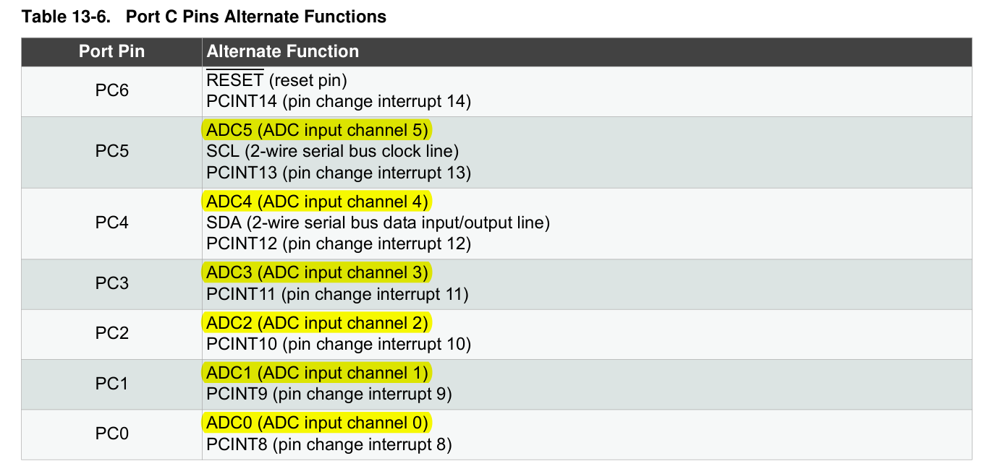

## ADC

* The ADC converts an analog input voltage to a 10-bit digital value through successive approximation. 
* The minimum value represents GND and the maximum value represents the voltage on the AREF pin minus 1 LSB. 

