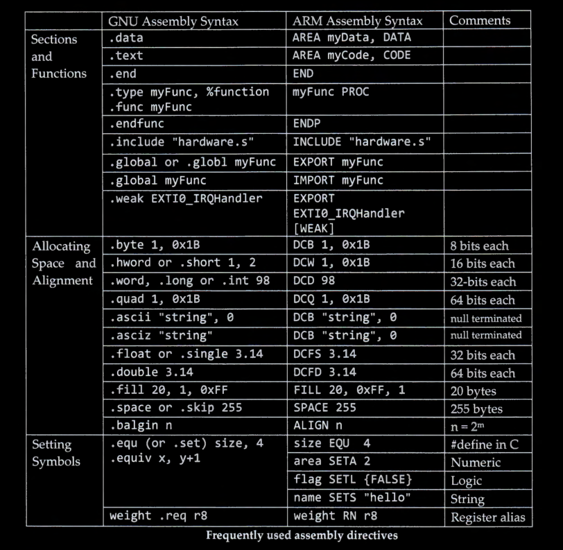
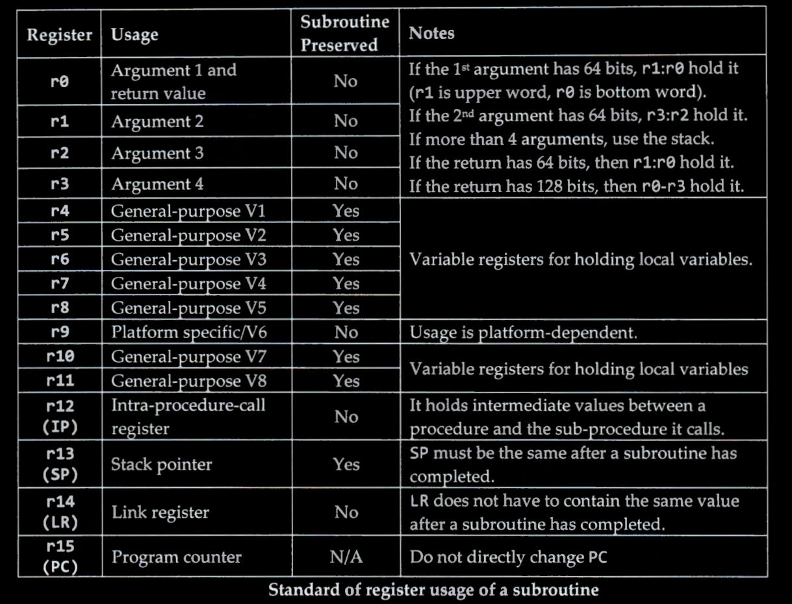

# Lab 2

  

| Directive | Description |
|-----------|-------------|
| `.align expression [, expression]` | Generic alignment directive. For ARM, if the first argument is zero, it pads to the next four-byte boundary for compatibility with ARM's assembler. |
| `.even` | Aligns to an even-numbered address. |
| `.arch name` | Selects the target architecture.|
| `.syntax [unified \| divided]` | Sets the Instruction Set Syntax. |
| `.code [16\|32]` | Selects the instruction set being generated. 16 selects Thumb, 32 selects ARM. |
| `.thumb` | Performs the same action as `.code 16`. |
| `.arm` | Performs the same action as `.code 32`. |
| `.arch_extension name` | Adds or removes an architecture extension to the target architecture. Can be used multiple times to incrementally modify the architecture. |
| `.cpu name` | Selects the target processor.|
| `.force_thumb` | Forces the selection of Thumb instructions, even if the target processor doesn't support them. |
| `.fpu name` | Selects the floating-point unit to assemble for. Valid names match the -mfpu command-line option. |
| `.inst opcode [ , … ]` `.inst.n opcode [ , … ]` `.inst.w opcode [ , … ]` | Generates an instruction from a numerical opcode. `.inst.n` and `.inst.w` allow explicit Thumb instruction size specification. |
| `.pad #count` | Generates unwinder annotations for a stack adjustment. Positive values indicate stack space allocation by stack pointer decrement. |
| `name .req register name` | Creates an alias for a register name. |
| `.unreq alias-name` | Undefines a previously defined register alias. |
| `.thumb_func` | Specifies the following symbol is a Thumb-encoded function. Helps with interworking between ARM and Thumb instructions. |
| `.thumb_set` | Creates a symbol alias and marks it as a Thumb function entry point. |

---

  

## Stack

  

