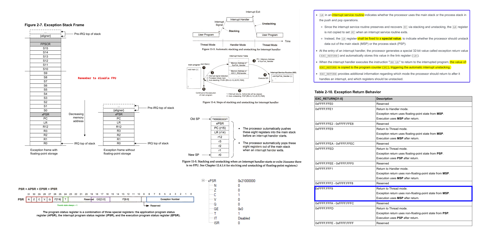
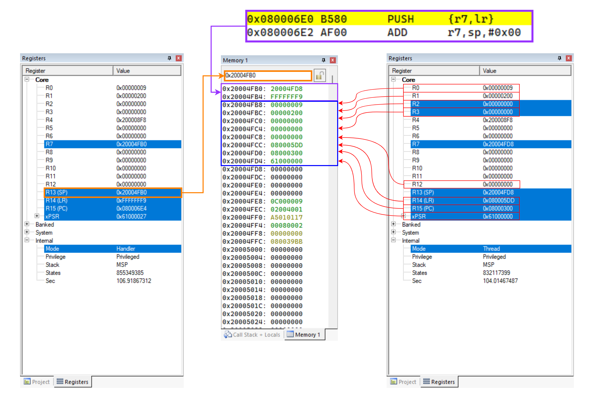
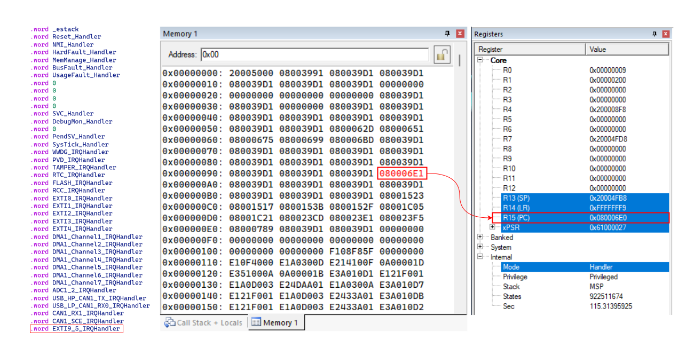

# Lab 6 - Exceptions and Interrupts

  

## CPU’s Hardwired Exception Processing 
1.  Finish current instruction (except for lengthy instructions).
    * Some instructions may take many cycles to execute (Load Multiple `LDM`, Store Multiple `STM`, `PUSH`, `POP`, `MULS`)
    * The processor will abandon the instruction and after the interrupt will restart it.
2.  Push context (8 32-bit words) onto current stack (`MSP` or `PSP`).
    * `xPSR`, Return address, `LR` (`R14`), `R12`, `R3`, `R2`, `R1`, `R0`.
3. Switch to handler/privileged mode, use `MSP`.
4. Load `PC` with address of exception handler.
5. Load `LR` with `EXC_RETURN` code.
6. Load `IPSR` with exception number.
7. Start executing code of exception handler.
8. Usually 16 cycles from exception request to execution of first instruction in handler.

  

  

  

* The LSB of each exception vector indicates whether the exception is to be executed in the Thumb state.
    * Since the Cortex-M processors can support only Thumb instructions, the LSB of all the exception vectors should be set to 1.