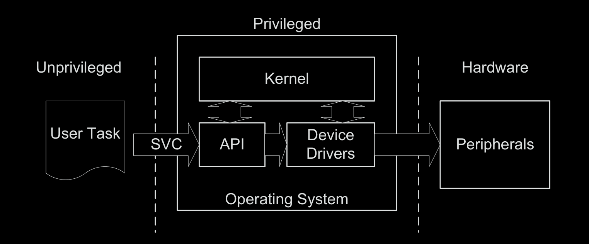
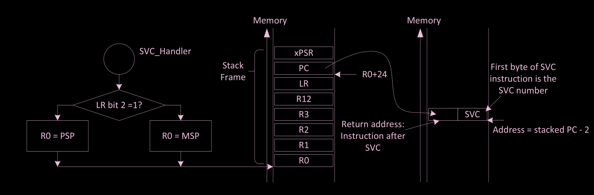
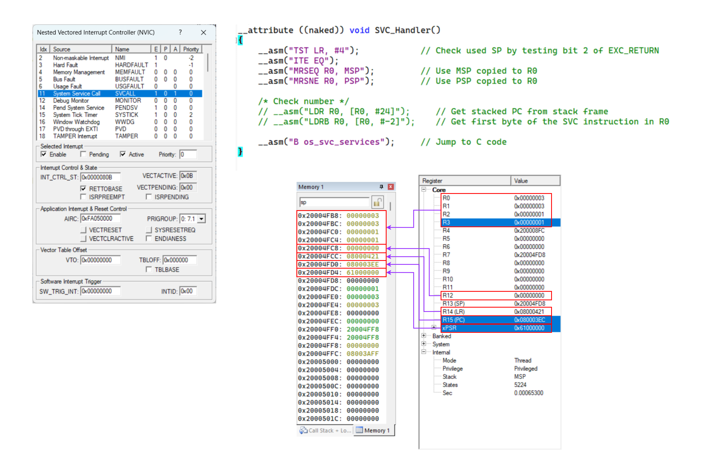
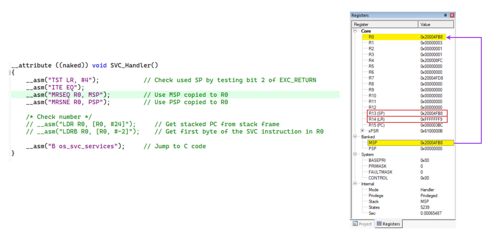
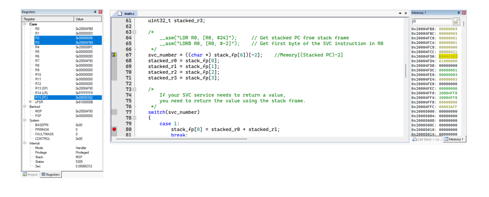
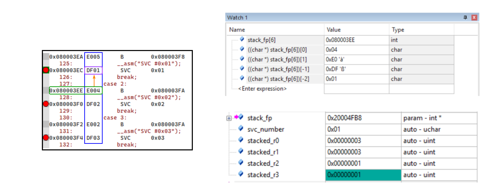
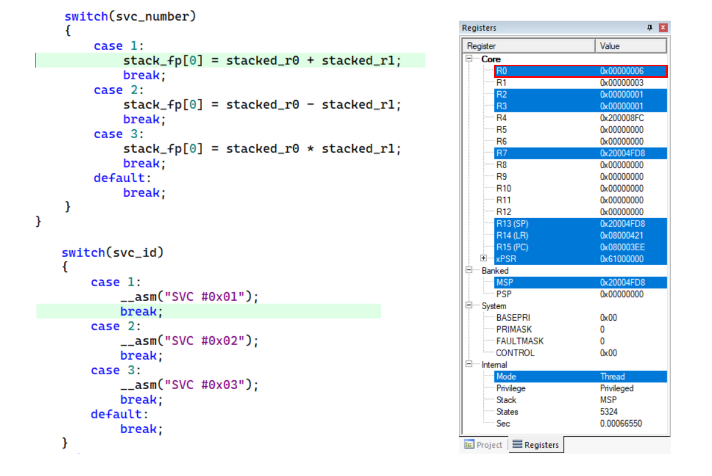
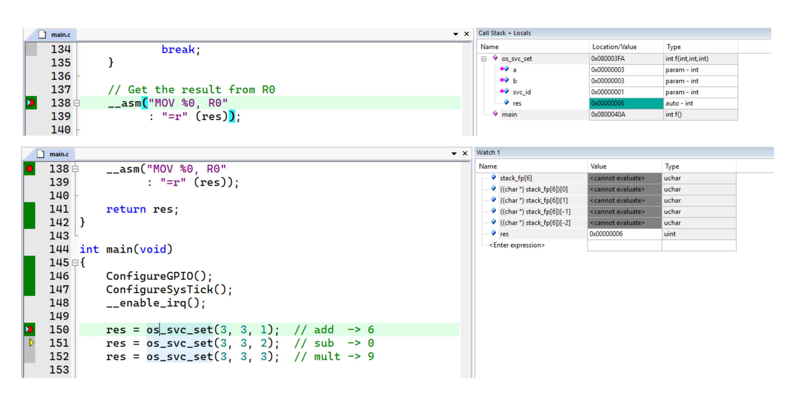

# SVC

* The SVC exception is triggered by the SVC instruction.
    * SVC is precise. The SVC handler must execute after the SVC instruction, except
when another higher-priority exception arrives at the same time.

* In many systems, the SVC mechanism can be used as an API to allow application
tasks to access system resources

  

* The only way an application task can access these protected hardware resources is via services from the OS.
    *  In this way, an embedded system can be more robust and secure, because the application tasks cannot gain unauthorized access to critical hardware.
* In some cases this also makes the programming of the application tasks easier because the application tasks do not need to know the programming details of the underlying hardware if the OS services provide what the task needs.
* SVC also allows application tasks to be developed independently of the OS because the application tasks do not need to know the exact address of the OS service functions.
* The application tasks only need to know the SVC service number and the parameters that the OS services requires. The actual hardware-level programming is handled by device drivers

---
* The SVC exception is generated using the SVC instruction. An immediate value
is required for this instruction, which works as a parameter-passing method. The
SVC exception handler can then extract the parameter and determine what action
it needs to perform.

  

* When the SVC handler is executed, you can determine the immediate data value
in the SVC instruction by reading the stacked Program Counter (PC) value, then
reading the instruction from that address and masking out the unneeded bits.
* However, the program that executed the SVC could have either been using the main stack
or the process stack. So we need to find out which stack was used for the stacking
process before extracting the stacked PC value.

---

  

  

  

  

  

  

  

