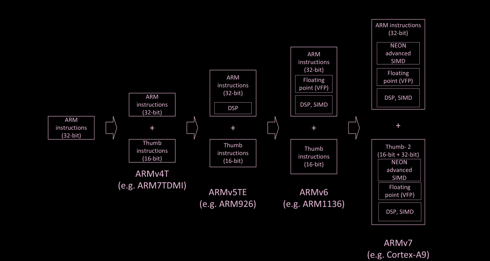
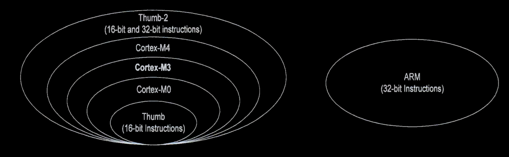
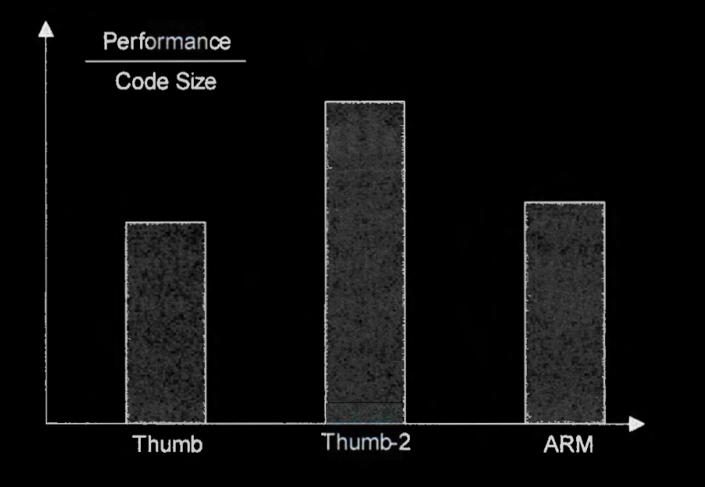
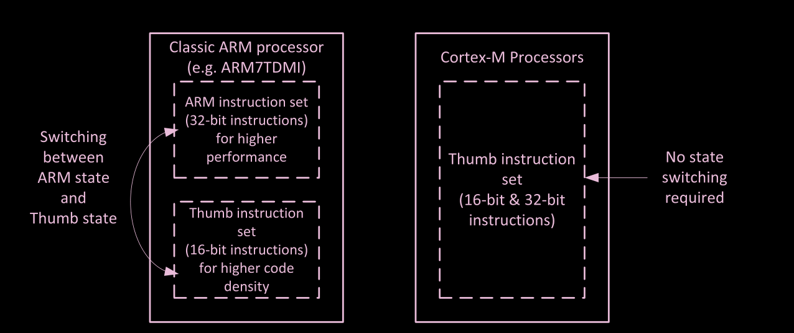
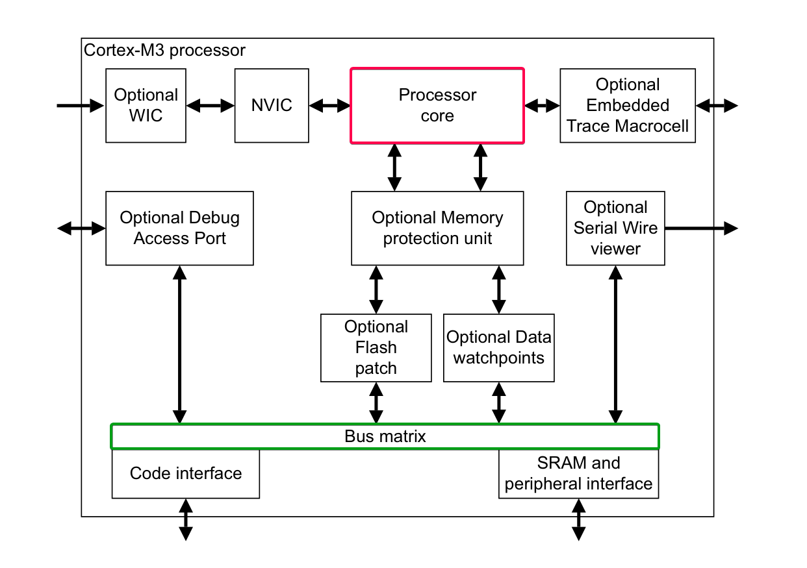
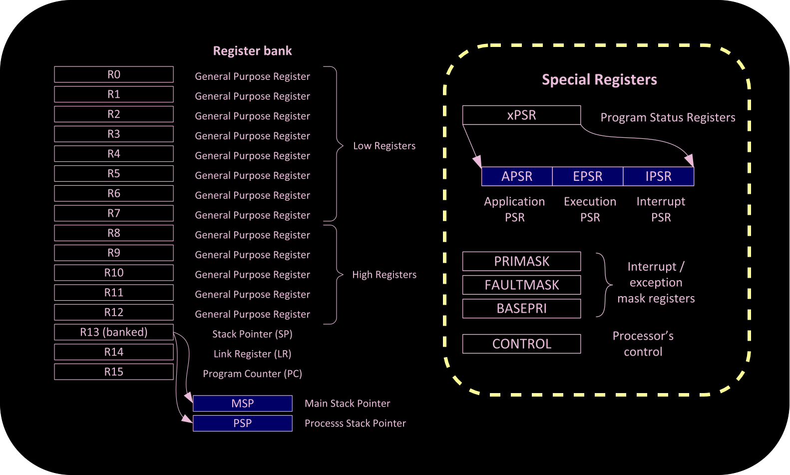
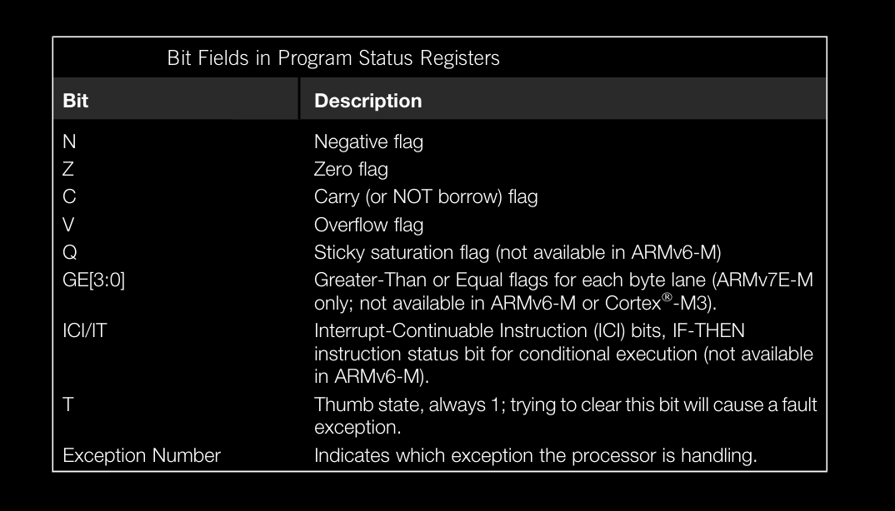
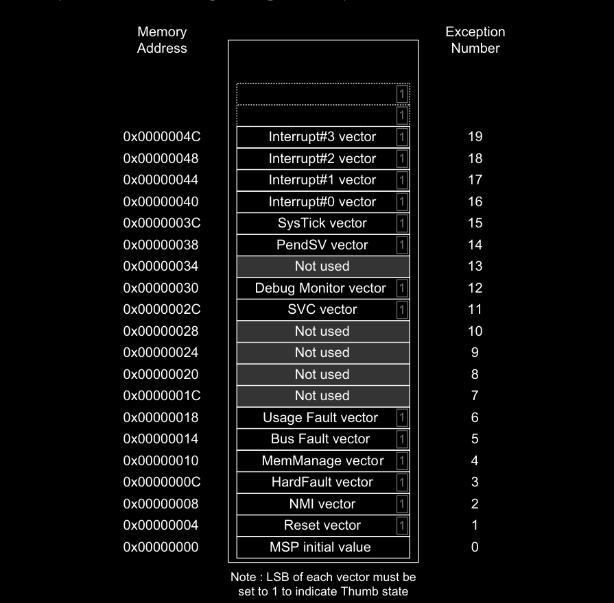
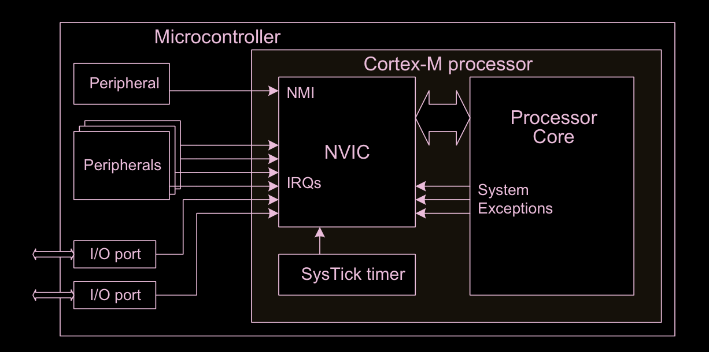

# ARM

<p align="center">
  
</p>

* **ARM Architecture Versions** 
    * Progressive iterations of ARM's processor design specification.
    * ex: `ARMv1`, `ARMv7`, `ARMv8`

* **Instruction Set Architecture**
    * Complete set of machine language instructions a processor can execute.
    * ex: `Thumb`, `ARM32`

* **Specific Processor Implementation Families** 
    * Distinct microarchitecture designs implementing ARM architecture.
    * **Micro-architecture**: Implementation-specific details such as interface signals, instruction execution timing, pipeline stages. Micro-architecture is processor design-specific.
    * ex: `ARM7TDMI`, `Cortex-M`
    

* Various versions of the ARM Architecture exist for the different ARM processors released over the years.
    * For example, the `Cortex-M3` and `Cortex-M4` processors are both implementations of `ARMv7-M` Architecture.
* An Instruction Set Architecture can be implemented with various implementations of micro-architecture; 
    * for example, different numbers of pipeline stages, different types of bus interface protocol, etc.


<p align="center">
  
</p>



## Instruction Set Architectures


* ARM processors support mainly four different assembly instruction sets:
    * `Thumb`
    * `Thumb-2`
    * `ARM32`
    * `ARM64`

* The legacy `ARM` instruction set includes 32-bit instructions.
* All instructions in the `Thumb` instruction set have only 16 bits. 
    * The `Thumb-2` consists of all 16-bit `Thumb` instructions as well as many 32-bit instructions




* These instruction sets play different tradeoffs between **code density** and **performance**
    * Code density measures the size of a binary executable program.
    * A high code density means that the binary program has a less number of bytes so it is often preferred in embedded systems because less memory is required, thereby directly reducing cost and power consumption.

* `Thumb` The objective of the Thumb instruction set is to improve the code density.
    * The Thumb instruction set is a subset of the ARM instruction set, re-encoded to 16 bits.
    * Instruction in Thumb has only 16 bits in length so the size of their executable files is small.
    * The space saving is achieved by :
        * Reducing the possibilities of operands
        * Limiting the number of registers that are accessible by an instruction. 

* `ARM32` Each instruction in ARM32 has 32 bits and provides more coding flexibility than a Thumb instruction. 
    * More operand options
    * more flexible memory addressing schemes
    * larger immediate numbers
    * More addressable registers can be encoded in a 32-bit word.
    * ARM32 instructions run faster than Thumb because an instruction can perform more operations or include more operands.
    * However, the disadvantage is its code density.

* `Thumb-2` It provides an outstanding compromise between ARM32 and Thumb as it allows a mixture of 16-bit and 32-bit instructions.
    * It optimizes the tradeoff between code density and processor performance.
    * It consists of 16-bit Thumb instructions and a subset of 32-bit ARM32 instructions.
    * The goal of Thumb-2 is to achieve higher code density like Thumb and fast performance comparable to ARM32.

* `ARM64` ARM 64-bit processors are often used in desktops and servers. 
    * These processors have a set of 64-bit assembly instructions.



---

## Specific Processor Implementation Families

<p align="center">
  
</p>


* One prominent ARM family is `Cortex` processors, which have three groups:
    * `Cortex-M` series for microcontrollers (M stands for microcontroller),
    * `Cortex-R` series for real-time embedded systems (R stands for real-time), and
    * `Cortex-A` series for high-performance applications (A stands for application).

* `Cortex-A` processors are specially designed based on the ARMv7-A or ARMv8-A architecture to provide fast performance for sophisticated devices, such as smartphones and tablets.
    * They often support full-fledged operating systems such as Linux, iOS, and Android.

* `Cortex-R` processors are designed for mission-critical real-time systems that require high reliability, fault-tolerance, and most importantly, deterministic real-time responsiveness.
    * In real-time systems, the correctness of computation is determined not only by the logical correctness but also by whether it is consistently completed within certain time constraints.

* `Cortex-M` processors offer an excellent tradeoff between performance, cost, and energy efficiency. 
    * They are suitable for a broad range of microcontroller applications, such as home appliances, robotics, industrial control, smart watch, and internet-of-things (IoT).
    * In contrast to general-purpose processors in desktops, a microcontroller is a small processor with a processor core, memory, and many integrated I/O peripherals.

* The `Cortex-M` family includes Cortex-M0, Cortex-M0+, Cortex-M1, Cortex-M3, Cortex-M4, and Cortex-M7.
    * The former three are Von Neumann architecture, and the latter three are Harvard architecture. 
    * Moreover, Cortex-M0/M0+/M1 are ARMv6-M, and Cortex-M3/M4/M7 are ARMv7-M.

    
* ARMv7-M architecture, including Cortex-M3, Cortex-M4, and Cortex-M7 only supports the `Thumb-2` instruction set and is not compatible with `ARM32` it do not its instructions at all.

* In classic ARM processors, for example, the ARM7TDMI, the processor has two operation states: a 32-bit ARM state and a 16-bit Thumb state. 
    * In the ARM state,the instructions are 32-bit and the core can execute all supported instructions with very high performance. 
    * In Thumb state, the instructions are 16-bit, which provides excellent code density, but Thumb instructions do not have all the functionality of ARM instructions and more instructions may be needed to complete certain types of operation.

* Cortex-M processors can run a mix of 16-bit and 32-bit `Thumb-2` instructions without changing the processor state, thus eliminating the overhead of state switching.
    * There is overhead (in terms of both execution time and instruction count) to switch between the states, and the separation of two states can increase the complexity of the software compilation process and make it harder for inexperienced developers to optimize the software



* `Cortex-M` processors are **backward compatible**
    * Cortex-M3 series extends Cortex-M0 series by adding More instructions for advanced data processing and bit field manipulations. 
    * Cortex-M4 extends Cortex-M3 by adding digital signal processing and floating-point arithmetic instructions.
        * a binary program compiled for Cortex-M3 can run on Cortex-M4 without any modification.


* The floating-point unit (FPU), which is a coprocessor for floating-point operations, is optional on Cortex-M4 and Cortex-M7.

* Cortex-M4 and M7 also provide single-instruction multiple-data (SIMD) and multiply-and-accumulate (MAC) instructions for digital signal processing applications (DSP).


---

## Cortex-M3 Case Study




* The processor implements the ARM v7-M architecture.
    * Includes the entire 16-bit Thumb instruction set and the base Thumb-2 32-bit instruction set architecture.

* The Cortex-M3 processor is built on a high-performance processor core, with a 3-stage pipeline Harvard architecture

### Cortex-M3 core peripherals
* Nested Vectored Interrupt Controller
    * The NVIC is an embedded interrupt controller that supports low latency interrupt processing.
* System Control Block
    * The System Control Block (SCB) is the programmers model interface to the processor. It provides system implementation information and system control, including configuration, control, and reporting of system exceptions.
* System timer
    * The system timer, SysTick, is a 24-bit count-down timer. Use this as a Real Time Operating System (RTOS) tick timer or as a simple counter.
* Memory Protection Unit
    * The MPU improves system reliability by defining the memory attributes for different memory regions. It provides up to eight different regions, and an optional predefined background region


### Privelage Levels
* Unprivileged
    * limited access to the `MSR` and `MRS` instructions, and cannot use the `CPS` instruction
    * cannot access the system timer, NVIC, or system control block
    * might have restricted access to memory or peripherals.
    * Unprivileged software can use the `SVC` instruction to make a supervisor call to transfer control to privileged software.
* Privileged 
    * The software can use all the instructions and has access to all resources.

### Operating Modes
* **Thread mode** is entered on Reset, and can be entered as a result of an exception return.
    * Used to execute application software.
    * Privileged and User (Unprivileged) code can run in Thread mode.
    * In Thread mode, the `CONTROL` register controls whether software execution is privileged or
unprivileged
* **Handler mode** is entered as a result of an exception. 
    * All code is privileged in Handler mode.
    * The processor returns to Thread mode when it has finished all exception processing.

### Operating states
* **Thumb state** This is normal execution running 16-bit and 32-bit halfword aligned Thumb and Thumb-2 instructions.
    * If the processor is running program code (Thumb instructions), it is in the Thumb state.
    * Unlike classic ARM processors like ARM7TDMI, there is no ARM state because the Cortex-M processors do not support the ARM instruction set.
* **Debug State** This is the state when in halting debug

<p align="center">
  
</p>

---
## Registers

In general, there are three types of instruction set architecture (ISA).
* **Accumulator-based instruction set**. One of the ALU source operands is implicitly stored in a special register called accumulator, and the ALU result is saved into the accumulator.
    * The programmer does not have to specify this operand and the destination register in the program.
    * The accumulator-based instruction set was popular in the 1950s.
* **Stack-based instruction set.** All ALU operands are assumed to be on top of the stack, and the ALU result is also placed on top of the stack.
    * Programmers need to push the value of operands onto the stack before an ALU operation is called. 
    * The stack-based instruction set was used in the 1960s.
* **Load-store instruction set**. ALU source or destination operands can be any general-purpose registers. 
    * ALU cannot directly use data stored in memory as operands. 
    * ALU can only access data in memory by using load or store instructions. 
    * Most modern processors are based on a load-store instruction set.

* In the ARM architecture, if data in memory is to be processed, it has to be:
    * Loaded from the memory to registers in the register bank
    * Processed inside the processor, and then written back to the memory, if needed (load-store architecture) 
* By having a sufficient number of registers in the register bank, this arrangement is easy to use, and allows efficient program code to be generated using C compilers.

<p align="center">
  
</p>


* Registers `R0` to `R12` are general purpose registers.
    * The first eight (`R0` - `R7`) are also called low registers. 
        * Due to the limited available space in the instruction set, many 16-bit instructions can only access the low registers. 
    * The high registers (`R8` - `R12`) can be used with 32-bit instructions, and a few with 16-bit instructions, like `MOV` (move).
    * The initial values of R0 to R12 are undefined.
* `R13` is the Stack Pointer. 
    * It is used for accessing the stack memory via `PUSH` and `POP` operations.
    * Physically there are two different Stack Pointers: 
        * The Main Stack Pointer `MSP` is the default Stack Pointer.
            * It is selected after reset, or when the processor is in Handler Mode.
        * The other Stack Pointer is called the Process Stack Pointer (PSP)
            * The `PSP` can only be used in Thread Mode.
    * The selection of Stack Pointer is determined by a special register called `CONTROL`.
    * In normal programs, only one of these Stack Pointers will be visible.
    * Both `MSP` and `PSP` are 32-bit, but the lowest two bits of the Stack Pointers (either MSP or PSP) are always zero, and writes to these two bits are ignored.
    * In ARM Cortex-M processors, `PUSH` and `POP` are always 32-bit, and the addresses of the transfers in stack operations must be aligned to 32-bit word boundaries.
    * For most cases, it is not necessary to use the `PSP` if the application doesn’t require an embedded OS, Many simple applications can rely on the `MSP` completely.
    * The `PSP` is normally used when an embedded OS is involved, where the stack for the OS kernel and application tasks are separated.
    * The initial value of `PSP` is undefined, and the initial value of `MSP` is taken from the first word of the memory during the reset sequence.

* `R14` is also called the Link Register (`LR`). 
    * This is used for holding the return address when calling a function or subroutine. 
    * At the end of the function or subroutine, the program control can return to the calling program and resume by loading the value of `LR` into the Program Counter (`PC`).
    * When a function or subroutine call is made, the value of `LR` is updated automatically.
    * If a function needs to call another function or subroutine, it needs to save the value of `LR` in the stack first, otherwise, the current value in `LR` will be lost when the function call is made.
    * During exception handling, the `LR` is also updated automatically to a special `EXC_RETURN` (Exception Return) value, which is then used for triggering the exception return at the end of the exception handler. 
    *  Although the return address values in the Cortex-M processors are always even (bit 0 is zero because the instructions must be aligned to half-word addresses), bit 0 of `LR` is readable and writeable. 
    * Some of the branch/call operations require that bit zero of `LR` (or any register being used) be set to 1 to indicate Thumb state.

* `R15` is the Program Counter (PC). 
    * It is readable and writeable: a read returns the current instruction address plus 4 (this is due to the pipeline nature of the design, and compatibility requirement with the ARM7TDMI processor).
    * Writing to `PC` (e.g., using data transfer/processing instructions) causes a branch operation.
    * Since the instructions must be aligned to half-word or word addresses, the Least Significant Bit (LSB) of the `PC` is zero.
    * However, when using some of the branch/memory read instructions to update the `PC`, you need to set the LSB of the new `PC` value to 1 to indicate the Thumb state.
    * Otherwise, a fault exception can be triggered, as it indicates an attempt to switch to use ARM instructions (i.e., 32-bit ARM instructions as in ARM7TDMI), which is not supported.
    * In high-level programming languages (including C, C++), the setting of LSB in branch targets is handled by the compiler automatically.
    * In most cases, branches and calls are handled by instructions dedicated to such operations.
    * It is less common to use data processing instructions to update the `PC`.
    * However, the value of PC is useful for accessing literal data stored in program memory.
    * So you can frequently find memory read operations with PC as base address register with address offsets generated by immediate values in the instructions.

* Besides the registers in the register bank, there are a number of special registers.
    * These registers contain the processor status and define the operation states and interrupt/exception masking.
    * In the development of simple applications with high level programming languages such as C, there are not many scenarios that require access to these registers.
    * However, they are needed for development of an embedded OS, or when advanced interrupt masking features are needed.

* The Program Status Register is composed of three status registers:
    * Application PSR (APSR)
    * Execution PSR (EPSR)
    * Interrupt PSR (IPSR)

<p align="center">
  
</p>


```arm
MRS r0, PSR ; Read the combined program status word
MSR PSR, r0 ; Write combined program state word

MRS r0, APSR ; Read Flag state into R0
MRS r0, IPSR ; Read Exception/Interrupt state
MSR APSR, r0 ; Write Flag state
```


---

### Vector table

* When an exception event takes place and is accepted by the processor core, the corresponding exception handler is executed. 
* To determine the starting address of the exception handler, a vector table mechanism is used.
* The vector table is an array of word data inside the system memory, each representing the starting address of one exception type.
* The vector table is relocatable and the relocation is controlled by a programmable register in the `NVIC` called the Vector Table Offset Register (`VTOR`).
* After reset, the `VTOR` is reset to 0; therefore, the vector table is located at address `0x0` after reset.
* The LSB of each exception vector indicates whether the exception is to be executed in the Thumb state.
    * Since the Cortex-M processors can support only Thumb instructions, the LSB of all the exception vectors should be set to 1.

<p align="center">
  
</p>


---

