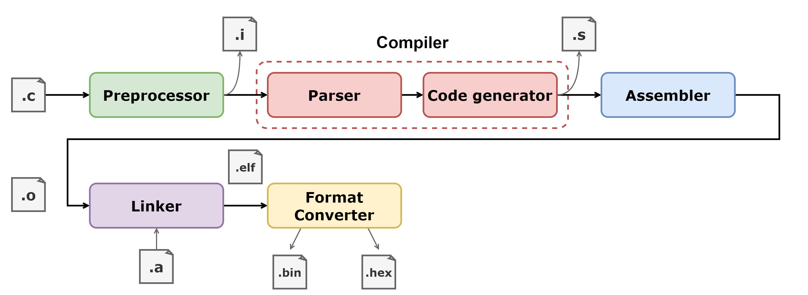
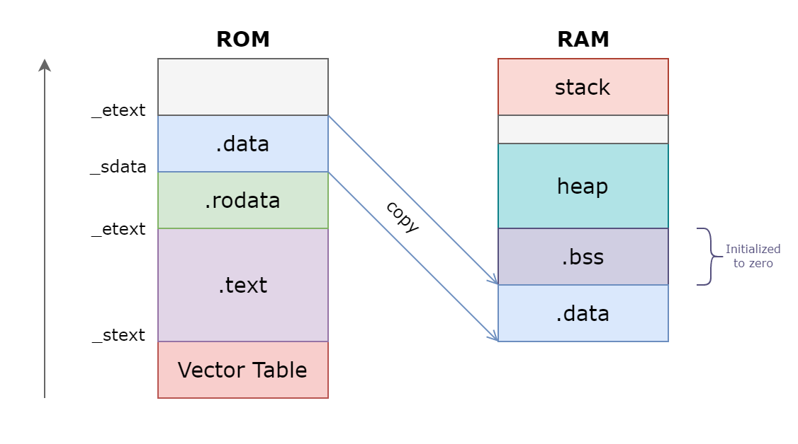
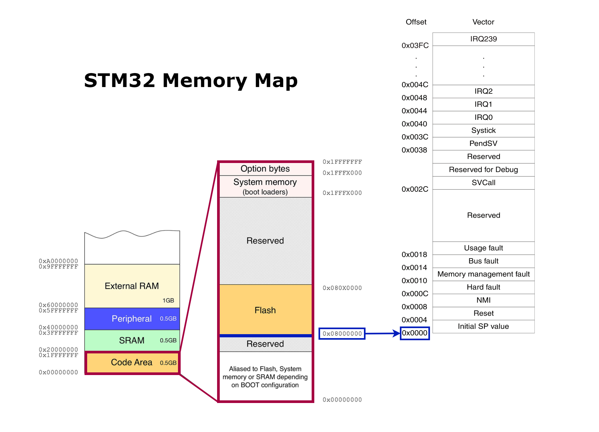
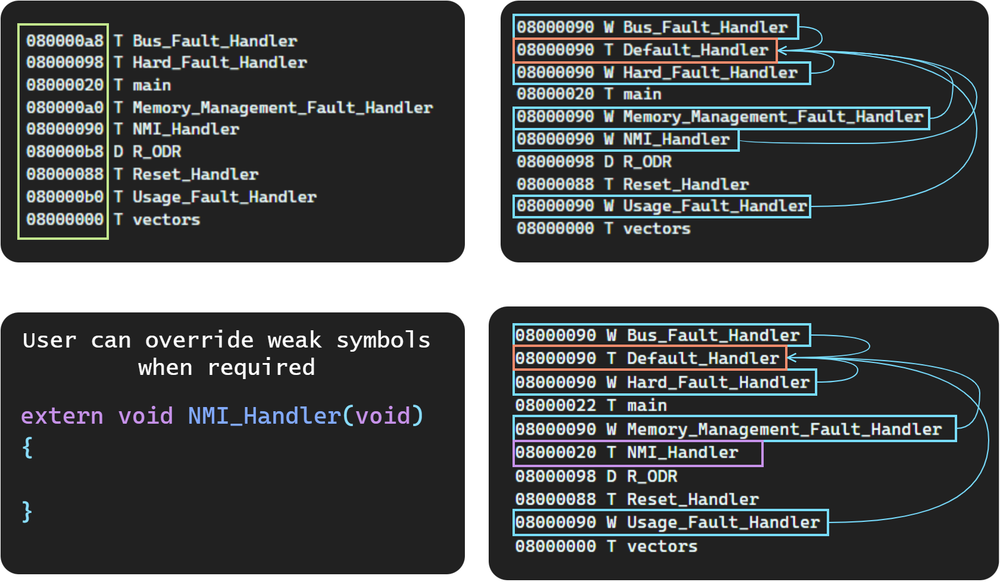
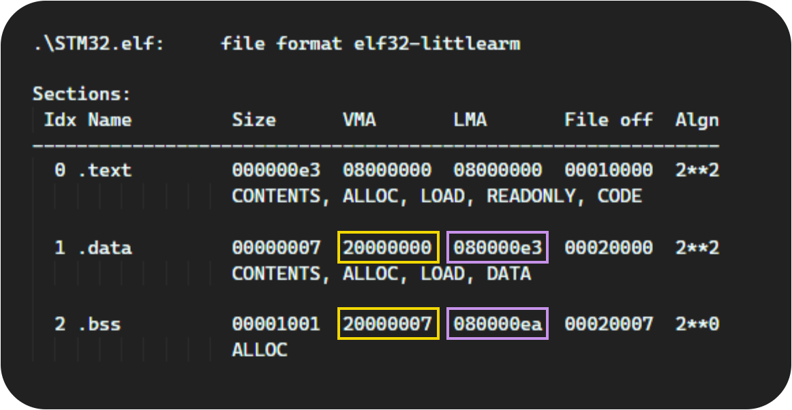
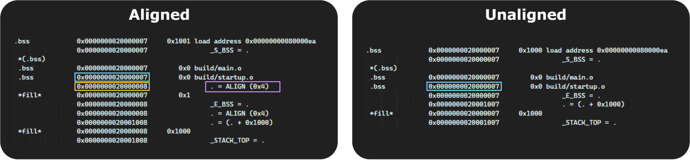
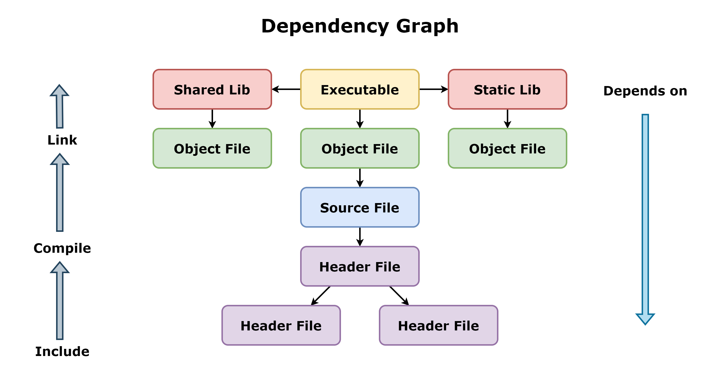
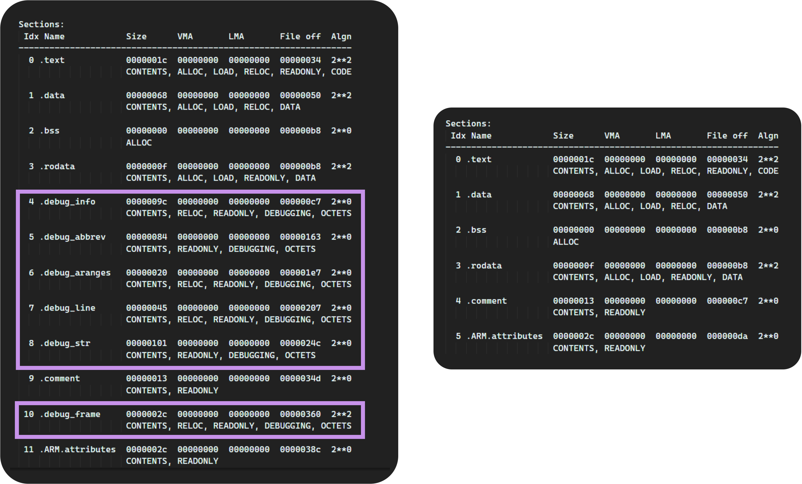
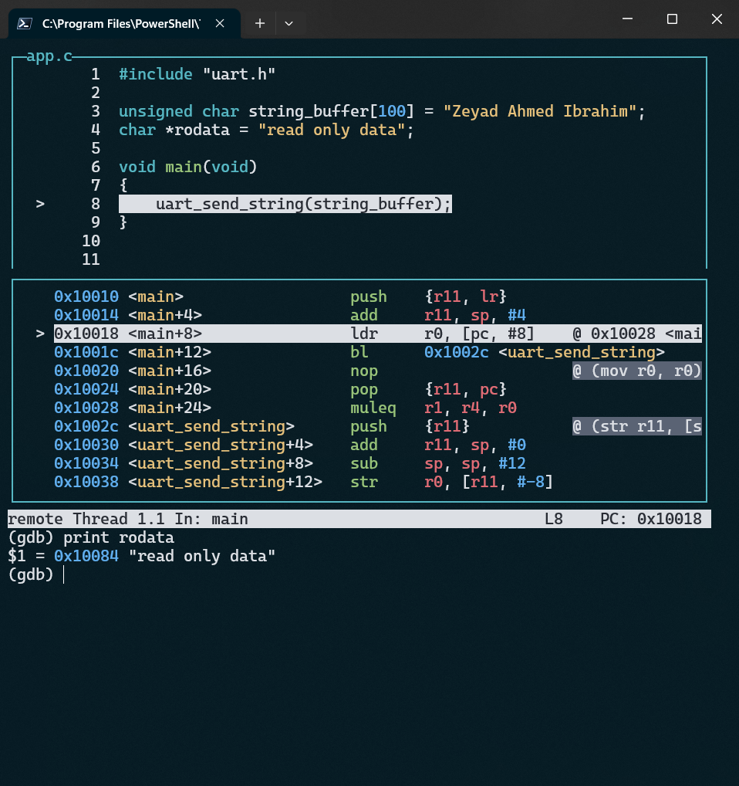

## Cross-Compilation Toolchain
* `arm-none-eabi-gcc`     : Compiler, linker and assembler
* `arm-none-eabi-as`      : Assembler
* `arm-none-eabi-ld`      : Linker
* `arm-none-eabi-objcopy` : Format converter
* `arm-none-eabi-objdump` : Display information from object files
* `arm-none-eabi-readelf` : Display information about ELF files
* `arm-none-eabi-nm`      : List symbols from object files

## Compiler Flags

|Flag|Meaning|
|:---:|:---:|
|`-B <directory>`| Add `<directory>` to the compiler's search paths.|
|`-v`|Display the programs invoked by the compiler.|
|`-E`|Preprocess only; do not compile, assemble or link.|
|`-S`|Compile only; do not assemble or link.|
|`-c`|Compile and assemble, but do not link.|
|`-o <file>`|Place the output into `<file>`.|
|`-save-temps`|Do not delete intermediate files.|
|`-time`|Time the execution of each subprocess.|
|`-std=<standard>`|Assume that the input sources are for `<standard>`.|
|`-march=<arch name>`|Specify the name of the target architecture.|
|`-mcpu=<cpu name>`|Specify the name of the target CPU., architecture is derived|
|`-mtune=`|Tune code for the given processor.|
|`-O<level>`|Optimization Level {0,1,2,3,s,fast,g}|
|`-g`|Produce debugging information|
|`-ggdb`|Produce debugging information for use by GDB.|
|`-gdwarf-2`|Produce debugging information in DWARF format (Proteus).|
|`-I dir`| Add the directory `dir` to the head of the list of directories to be searched for header files.|
|`-l library`|Search the library named `library` when linking.|
|`-L dir`|Add directory `dir` to the list of directories to be searched for `-l`|
|`-nostartfiles`|Do not use the standard system startup files when linking.|
|`-nostdlib`|Do not use the standard system startup files or libraries when linking.|
|`-Wl,option`| Pass `option` as an option to the linker.

## Compilation Process

<div style="border-radius: 30px; overflow: hidden;">
    <p align="center">
        
    </p>
</div>

## ELF Format

* **ELF** : Executable and Linkable Format
  * ELF is a standard file format for object files and executable files in GCC
* A file format standard describes a way of organizing various elements (data, read-only data, code, uninitialized data,etc.) of a program in different sections.

<div style="border-radius: 30px; overflow: hidden;">
    <p align="center">
        
    </p>
</div>

* `.text` : The machine code of the compiled program.
* `.rodata` : Read-only data 
* `.data` : Initialized global C variables.
  * Local C variables are maintained at run time on the stack, and do not appear in either the `.data` or `.bss` sections.
* `.bss` : Uninitialized global C variables.
  * This section occupies no actual space in the object file; it is merely a place holder.
  * Object file formats distinguish between initialized and uninitialized variables for space efficiency
  * uninitialized variables do not have to occupy any actual disk space in the object file.

## Relocatable object files

* `.o` files contains machine specific code and data of the program
  * it doesnt contain any absolute addresses.
* `arm-none-eabi-objdump` : display information from object files

### Objdump Flags

|Flag|Meaning|
|:---:|:---:|
|`-h`|Display the contents of the section headers|
|`-x`|Display the contents of all headers|
|`-d`|Display assembler contents of executable sections|
|`-D`|Display assembler contents of all sections|
|`-S`|Intermix source code with disassembly|


```c
#include "uart.h"

unsigned char string_buffer[100] = "Zeyad Ahmed Ibrahim"; // .data
char *rodata = "read only data";                          // .rodata

void main(void)
{
    uart_send_string(string_buffer);
}
```

<div style="border-radius: 30px; overflow: hidden;">
    <p align="center">
        
    </p>
</div>

* `ALLOC` – Section will have space allocated in the process when loaded.
  *  Set for all sections except those containing debug information.
* `LOAD` – Section will be loaded from the file into the child process memory.
  * Set for pre-initialized code and data, clear for .bss sections.
* `RELOC` – Section needs to be relocated before loading.
* `READONLY` – Section cannot be modified by the child process.
* `CODE` – Section contains executable code only.
* `DATA` – Section contains data only (no executable code).

---

## Start-up File

* Startup file is responsible for setting up the enviroment for the main user code to run.
* Code written in startup file runs before `main()`.
* Some parts of the startup code is target dependent.
* **Startup code takes care of :**
  * Vector table placement.
  * Stack reinitialization.
* Startup code is responsible of `.data` , `.bss` section initialization in main memory
  * Copy `.data` section to RAM.
  * Initialize the `.bss` section to zero in RAM.

<div style="border-radius: 30px; overflow: hidden;">
    <p align="center">
        
    </p>
</div>

* Section boundary information and sizes need to be exported from a **linker script** to the startup file.

### Functional Attribute
* In GNU C and C++, you can use function attributes to specify certain function properties that may help the compiler optimize calls or check code more carefully for correctness. 
* You can also use attributes to control memory placement, code generation options or call/return conventions within the function being annotated.
* Many of these attributes are target-specific.
  * However, a considerable number of attributes are supported by most, if not all targets.
* Function attributes are introduced by the `__attribute__` keyword in the declaration of a function, followed by an attribute specification enclosed in double parentheses.

#### Common Function Attributes

* `section ("section-name")`
  * Normally, the compiler places the code it generates in the text section. Sometimes, however, you need additional sections, or you need certain particular functions to appear in special sections. 
  * The section attribute specifies that a function lives in a particular section. 
* `weak`
  * The weak attribute causes a declaration of an external symbol to be emitted as a weak symbol rather than a global.
  * This is primarily useful in defining library functions that can be overridden in user code
  * The overriding symbol must have the same type as the weak symbol.
  * In addition, if it designates a variable it must also have the same size and alignment as the weak symbol.
* `alias ("target")`
  * The alias attribute causes the declaration to be emitted as an alias for another symbol, which must have been previously declared with the same type, and for variables, also the same size and alignment.
* `aligned (alignment)`
  * The aligned attribute specifies a minimum alignment for the first instruction of the function, measured in bytes.
  * When specified, alignment must be an integer constant power of 2.
  * Specifying no alignment argument implies the ideal alignment for the target.

### Vector Table (STM32 Case Study)
* The vector table is a section of our flash memory that mostly holds the addresses of various handlers.
* Starting address of the reset handler (Reset handler is the code executed on reset)
* Starting addresses of all other exceptions and interrupts including the NMI handler, Hard fault handler and so on.

<p align="center">
  
</p>

* On many STM32 families, the boot address in the internal flash is 0x0800_0000. This address is remapped to address 0x0000_0000 by boot mode mechanism. 
* **Boot Sequence :**
  * Take the initial value of the Main stack pointer from the address 0x0000 (0x0800_0000) so we store in this location the SRAM address
  * Take the value of the program counter from the address 0x0004 (Reset_Handler).
  * Continue execution from the address corresponding to this value. 

```ARM
.section .vectors

.word   0x20001000    /* Stack top (SRAM) */
.word   _RESET        
.word   _NMI         
.word   _HARD_FAULT   
.word   _MEM_MGMT_FAULT     
.word   _BUS_FAULT    
.word   _USAGE_FAULT  
.word   _RESERVED
.word   _RESERVED
.word   _RESERVED
.word   _RESERVED
.word   _SVCALL
.word   _RESERVED_DBG
.word   _RESERVED
.word   _PENDSV
.word   _SYSTICK
.word   _IRQ_0
.word   _IRQ_1
/* ....................... */
.word   _IRQ_
```

* **Startup in C**
  * As (CortexM3) can intalize the stack pointer with the first 4 bytes, so we can write startup in C code.

<table>
<tr>
<th> Basic </th>
<th> Using Weak and Alias Attributes </th>
</tr>
<tr>
<td>

```c
#define STACK_TOP 0x20001000

extern int main(void);

void Reset_Handler(void)
{
    main();
}

void NMI_Handler(void)
{
    Reset_Handler();
}
void Hard_Fault_Handler(void)
{
    Reset_Handler();
}

uint32 vectors[] __attribute__((section(".vectors"))) = {
    STACK_TOP,
    (uint32) &Reset_Handler,
    (uint32) &NMI_Handler,
    (uint32) &Hard_Fault_Handler
};
```

</td>
<td>

```c
#define STACK_TOP 0x20001000

extern int main(void);

void Reset_Handler(void);

void Default_Handler()
{
    Reset_Handler();
}

void NMI_Handler(void) __attribute__ ((weak,alias("Default_Handler")));
void Hard_Fault_Handler(void) __attribute__ ((weak,alias("Default_Handler")));

uint32 vectors[] __attribute__((section(".vectors"))) = {
    STACK_TOP,
    (uint32) &Reset_Handler,
    (uint32) &NMI_Handler,
    (uint32) &Hard_Fault_Handler,
};

void Reset_Handler(void)
{
    main();
}
```

</td>
</tr>
</table>


<p align="center">
  
</p>

## Initialize Memory

```c
void Mem_Init(void)
{
    extern uint32 _S_DATA;
    extern uint32 _E_DATA;
    extern uint32 _S_BSS;
    extern uint32 _E_BSS;
    extern uint32 _E_TEXT;

    /********* Copy from FLASH to SRAM *********/

    uint32 size_data = (uint32)&_E_DATA - (uint32)&_S_DATA;

    byte *dst = (byte *)(&_S_DATA); // SRAM
    byte *src = (byte *)(&_E_TEXT); // FLASH

    for(uint32 i = 0; i < size_data; i++){
        *dst++ = *src++;
    }
    
    /**************** Zero BSS ****************/

    uint32 size_bss = (uint32)&_E_BSS - (uint32)&_S_BSS;

    dst = (byte *)&_S_BSS;

    for(uint32 i = 0; i<size_bss; i++){
        *dst++ = (byte)0;
    }
}
```

<p align="center">
  
</p>


---

## Linker Script

* Linker script is a text file which explains how different sections of the object files should be merged to create an output file.
* Linker and locator assign absolute addresses to different section of the output file by referring to address information mentioned in the linker script.
* Linker script also includes the code and data memory address and size information.
* Linker scripts are written using the GNU Linker command Language and has the file extension `.ld`.

### Linker Script Commands

|Command|Meaning|
|:---:|:---:|
|`ENTRY`|command specifically for defining the first executable instruction in an output file (its entry point).|
|`MEMORY`|describes the location and size of blocks of memory in the target.|
|`SECTIONS`|controls exactly where input sections are placed into output sections, their order in the output file, and to which output sections they are allocated.|


* `ENTRY(symbol)` 

```
MEMORY 
  {
    name (attr) : ORIGIN = origin, LENGTH = len
    ...
  }
```

* `MEMORY`: you can describe which memory regions may be used by the linker, and which memory regions it must avoid.
  * `attr` define the attribute list of the memory region.
  * `name` is a name used internally by the linker to refer to the region.
  * `origin` is the start address of the region in physical memory.
  * `len` is the size in bytes of the region (an expression). 


|attr|Meaning|
|:---:|:---:|
|`R`|Read-only sections.|
|`W`|Read/write sections.|
|`X`|Sections containing executable code.|
|`A`|Allocated sections.|
|`I`|Initialized sections.|

```
SECTIONS { ...
  secname : {
    contents
  }
... }
```
* `SECTION` specifies the properties of an output section.
  * its location, alignment, contents, fill pattern, and target memory region.
  * The linker will not create output sections which do not have any contents. 
  * `secname` must meet the constraints of your output format.

* In the following example, the command script arranges the output file into three consecutive sections, named `.text`, `.data`, and `.bss`, taking the input for each from the correspondingly named sections of all the input files:


```
SECTIONS { 
  .text : 
  {
    *(.text)                   // merge .text section of all input files
    *(.rodata)
  }>(vma) AT> (lma)

  .data :
  {
    *(.data) 
  }>(vma) AT> (lma)

  .bss :
  {
    *(.bss)
    *(COMMON) 
  }>(vma) AT> (lma) 
}
```

* `AT (ldadr)` The expression `ldadr` that follows the `AT` keyword specifies the load address of the section. 
* `>region` Assign this section to a previously defined region of memory. 
* `LOADADDR(section)` Return the absolute load address of the named section.
* `SIZEOF(section)` Return the size in bytes of the named section, if that section has been allocated.

* **Location Counter :** The special linker variable dot `.` always contains the current output location counter. 
  * it must always appear in an expression within a `SECTIONS` command. 
  * Assigning a value to the `.` symbol will cause the location counter to be moved.
    * This may be used to create holes in the output section.
  * The location counter **cannot** moved backwards.
  * You can use this symbol inside the linker script to track and define boundaries of various sections.


* `ALIGN(exp)` Return the result of the current location counter `.` aligned to the next `exp` boundary.
  *  `exp` must be an expression whose value is a power of two. 

```
SECTIONS
{
  output :
  {
  . = 0x10000;  
  file1(.text)
  . = . + 1000;
  file2(.text)
  . += 1000;
  file3(.text)
  } = 0x1234;
}
```

### Linker Script symbols
* A symbol is the name of an address

<div style="border-radius: 30px; overflow: hidden;">
    <p align="center">
        
    </p>
</div>

* `T` : The symbol is in the text (code) section.
* `D` : The symbol is in the initialized data section.
* `U` : The symbol is undefined.

## Linking

* `arm-none-eabi-ld`      : Linker

|Flag|Meaning|
|:---:|:---:|
|`-T script`|Use script as the linker script.|
|`-nostdlib`|Do not use the standard system startup files or libraries when linking.|
|`-Map=<file.map>`|Write a linker map to `<file>`|

* Linking is the process of collecting and combining the various pieces of code and data that a program needs in order to be loaded (copied) into memory and executed. 
* Linkers play a crucial role in software development because they enable separate compilation.
  * Instead of organizing a large application as one source file, we can decompose it into smaller, more manageable modules that can be modified and compiled separately.
  * When we change one of these modules, we simply recompile it and relink the application, without having to recompile the other files.
* Linker program take as input a collection of relocatable object files and command line arguments and generate as output a fully linked executable object file that can be loaded and run.
  * The input relocatable object files consist of various code and data sections.
  * Instructions are in one section (`.text`), initialized global variables are in another section (`.data`), and uninitialized variables are in yet another section (`.bss`).
* To build the executable, the linker must perform two main tasks:
  * **Symbol resolution :** Object files define and reference symbols.
    * The purpose of symbol resolution is to associate each symbol reference with exactly one symbol definition.
  * **Relocation :** Compilers and assemblers generate code and data sections that start at address zero.
    * The linker relocates these sections by associating a memory location with each symbol definition, and then modifying all of the references to those symbols so that they point to this memory location.
* A linker concatenates blocks together, decides on run-time locations for the concatenated blocks, and modifies various locations within the code and data blocks. 

<div style="border-radius: 30px; overflow: hidden;">
    <p align="center">
        
    </p>
</div>

### Final Executable Symbol Table

<div style="border-radius: 30px; overflow: hidden;">
    <p align="center">
        
    </p>
</div>

## Case Study (STM32)

```ld
MEMORY
{
    FLASH(RX) : ORIGIN = 0x08000000, LENGTH = 128k
    SRAM(RWX) : ORIGIN = 0x20000000, LENGTH = 20k
}

SECTIONS
{
    .text : 
    {
        *(.vectors*)
        *(.text*)
        *(.rodata)
        _E_TEXT = . ;
    } > FLASH

    .data :
    {
        _S_DATA = . ;
        *(.data)
        _E_DATA = . ;
    }>SRAM AT> FLASH

    .bss :
    {
        _S_BSS = . ;
        *(.bss)
        . = ALIGN(4);
        _E_BSS = . ;

        . = ALIGN(4);
        . = . + 0x1000 ;
        _STACK_TOP = . ;
    }>SRAM
}
```

<p align="center">
  
</p>

## Integrating C Standard Library

* **Newlib** is a C standard library implementation intended for use on embedded systems.
  * Newlib is included in the GNU Arm toolchain, **nano** is a smaller implementation optimized for "small" embedded applications it focuses on code and data size reduction through optimization and removal of non-MCU features.

<p align="center">
  
</p>

* Newlib implements the hardware independent parts of the C library and rely on a few low-level system calls that must be implemented with the target hardware in mind
  * when using newlib you must implement the system calls appropriately to support devices, file-systems, and memory management.

* **Complete List :**
```
_exit, _close, environ, execve, fork, fstat, getpid, isatty, kill, link, lseek, open, read, _sbrk, stat, times, unlink, wait, write
```
* several of the syscalls relate to filesystem operation or process control.
  *  These do not make much sense in a firmware context, so we’ll often simply provide a stub that returns an error code.

* **Most Important syscalls :**

|System Call|Meaning|
|:---:|:---:|
|`sbrk_`|Increase program data space,` malloc` and related functions depend on this|
|`write_`|Write to a file. libc subroutines will use this system routine for output to all files, including stdout|
|`read_`|Read from a file.|

* In GCC, you can create a spec file -using the `-specs=` option- containing compiler options and settings.
  *  This option allows you to encapsulate a set of compiler and linker options in a single file, which can make it more convenient to manage complex build configurations.
* We will use `--specs=nano.specs`.


---
# Makefile

### Dependency Graph

<p align="center">
  
</p>

### Rules
* **Target :** Files you want to build.
* **Dependencies :** File that is used as input to create the **Target**.
* **Recipe :** Definition of how you go from a complete list of **Dependencies** to the given **Target**.
  * A recipe may have more than one command, either on the same line or each on its own line.
  * You **must** put a tab character at the beginning of every recipe line!

* You can format your makefiles for readability by adding newlines into the middle of a statement: you do this by escaping the internal newlines with a backslash `\` character.


```make
target … : prerequisites …
        recipe
        long-line \
        continue long line
        …
        …
```
* when you give the command `make` (with no arguments):
  * By default, `make` starts with the **first** target.
  * before `make` can fully process this rule, it must process the rules for the files that its target depends on.
  * Any rule that doesnt depend on the initial target wont run at all unless explicitly called with an argument to `make` command.
* `make` does its work in two distinct phases.
  * **First phase :** it reads all the makefiles, included makefiles, etc. and internalizes all the variables and their values and implicit and explicit rules, and builds a dependency graph of all the targets and their prerequisites.
    * Therefore order of rules is not significant, except for determining the default goal (First rule)
  * **Second phase :** `make` uses this internalized data to determine which targets need to be updated and run the recipes necessary to update them.
* **Variables :**
  * A variable is a name defined in a makefile to represent a string of text ( `foo=value` or `foo:=value` )
  * To substitute a variable’s value, write a dollar sign followed by the name of the variable in parentheses or braces: either `$(foo)` or `${foo}`

* **Automatic Variables**
  * `$@` The file name of the target of the rule.
  * `$^` list of all the prerequisites of the rule.
  * `$<` The name of the first prerequisite (for header files).

### Wildcards
* A single file name can specify many files using wildcard characters like (`*`, `?` and `[…]`)
    * `*` : represent any number of characters 
    * `?` : represent any single character.
    * `[]` : specifies a range.

*  Wildcard expansion does not happen when you define a variable.
   *  you must use the function `wildcard` 
   *  `objects := $(wildcard *.o)`

### VPATH and vpath
* The value of the make variable `VPATH` specifies a list of directories that make should search. Most often, the directories are expected to contain prerequisite files that are not in the current directory; however, make uses `VPATH` as a search list for both prerequisites and targets of rules.
  * `VPATH = src:../headers` specifies a path containing two directories, `src` and `../headers`
  * `foo.o : foo.c` is equivalent to `foo.o : src/foo.c`
* the `vpath` directive (note lower case), which allows you to specify a search path for a particular class of file names: those that match a particular pattern. 
  * `vpath %.h ../headers` tells make to look for any prerequisite whose name ends in .h in the directory ../headers if the file is not found in the current directory.

* **Pattern rule**
```
%.o: %.c
        $(CC) -c $^ -o $@ 
```
* It specifies one target and one dependency, and causes one invocation of `$(CC)` for each target. 
  * The `%` matches any nonempty string, and the other characters match themselves.
  * `%.c` as a pattern matches any file name that ends in `.c`
  * `%` in a prerequisite of a pattern rule stands for the same **stem** that was matched by the `%` in the target.

* When a line starts with `@`, the echoing of that line is suppressed.

* **Substitution References**
  * A substitution reference substitutes the value of a variable with alterations that you specify. 
  * `$(var:a=b)` : its meaning is to take the value of the variable `var`, replace every `a` at the end of a word with `b` in that value, and substitute the resulting string.
  * `a` must appear either followed by whitespace or at the end of the value in order to be replaced; other occurrences of a in the value are unaltered.

*  the `-j` option tells make to execute many recipes simultaneously.
   *  If the `-j` option is followed by an integer, this is the number of recipes to execute at once; 
   *  If a makefile completely and accurately defines the dependency relationships between all of its targets, then make will correctly build the goals regardless of whether parallel execution is enabled or not. 

### Useful functions
* Functions for String Substitution
  * `$(subst from,to,text)`
  * `$(patsubst pattern,replacement,text)`
  * `$(sort list)`

* We can change the list of C source files into a list of object files by replacing the ‘.c’ suffix with ‘.o’ in the result, like this:
  * `$(patsubst %.c,%.o,$(wildcard *.c))`
* `$(addsuffix suffix,names…)` The value of suffix is appended to the end of each individual name and the resulting larger names are concatenated with single spaces between them.
* `$(addprefix prefix,names…)` The value of prefix is prepended to the front of each individual name and the resulting larger names are concatenated with single spaces between them.
* `$(join list1,list2)` 
  * `$(join a b,.c .o)` produces ‘a.c b.o’
* `$(foreach var,list,text)`  It causes one piece of text to be used repeatedly, each time with a different substitution performed on it.
* `$(notdir $(filename))` takes away the path from the file name leaving just the file name`

## Tracking Header files 

* Compiler Options Controlling the Preprocessor

|Flag|Meaning|
|:---:|:---:|
|`-M`|Instead of outputting the result of preprocessing, output a rule suitable for `make` describing the dependencies of the main source file. The preprocessor outputs one make rule containing the object file name for that source file, a colon, and the names of all the included files|
|`-MF <file>`|specifies a `file` to write the dependencies to.|
|`-MD`|equivalent to `-M -MF file`. The driver determines file based on whether an `-o` option is given. If it is, the driver uses its argument but with a suffix of `.d`, otherwise it takes the name of the input file, removes any directory components and suffix, and applies a `.d` suffix.|
|`-MP`|Construct dummy rules that work around errors `make` gives if you remove header files without updating the Makefile to match.|

```make
# Dependencies flags sent to the compiler.
DEPFLAGS=-MP -MD
# a dependecy file is created for each source file
DEP=$(addprefix $(BUILD_DIR)/,$(notdir $(SRC:.c=.d)))
-include $(DEP)
```

* The `include` directive tells `make` to suspend reading the current makefile and read one or more other makefiles before continuing.
  * When you want to generate prerequisites from source files automatically; the prerequisites can be put in a file that is included by the main makefile.
  * If you want `make` to simply ignore a makefile which does not exist or cannot be remade, with no error message, use the `-include` directive instead of `include` it acts like `include` in every way except that there is no error (not even a warning) if any of the filenames (or any prerequisites of any of the filenames) do not exist or cannot be remade.
---

## GDB

* `gdb-multiarch`

* Use `-g` flag while compiling to include debugging information. 


<p align="center">
  
</p>


### GDB Commands

|          Command         |            Meaning         |
|:------------------------:|:--------------------------:|
|`start`                   | Break at first instruction.|
|`r`                       | Run the program until a breakpoint. |
|`n`                       | Step over next C instruction|
|`s`                       | Step into next C instruction|
|`l`                       | Print lines of code around where you at|
|`b <l>`                   | Break at a line  |
|`b <function name>`       | Break at a function first instruction|
|`b <l/fn> if <condition>` | Break if given condition is met, `<condition>` is any C expression that evaluates to true or false.|
|`c`                       | Continue until a break point.|
|`f`                       | Continue running until just after function in the selected stack frame returns.|
|`watch <var>`             | Break when value of variable changes. |
|`i` + `b`                 | Info about all set breakpoints and watchpoints|
|`d`                       | Delete all breakpoints and watchpoints|
|`d <n>`                   | Delete breakpoint number `<n>`|
|`q`                       | Quit|
|`p <var>`                 | Print current value of a variable, `p/x <var>` Print the value in hexadecimal|
|`display <var>`           | For every step print the value of var, `undisplay <id>` |
|`whatis <var>`            | Print the data type of the variable and the last value in the value history.|
|`u` / `d`                 | Peak up and down the call stack|
|`bt`                      | Backtrace the entire call stack|
|`disas`                   | Dump disassembly of code|
|`shell <command>`         | Execute commands from terminal (ex `clear`)|
|`python <commands>`       | Full python interpreter inside gdb|
|`set var <name> = <value>`| Change the value of variable during debugging.|

* **Reverse debugging :**
  * `target record-full` : Record everything from this point
  * `r` + `n` : Step back over
  * `rs` + `n` : Step back into
* **Print memory :** `x/nfu` 
  * `n` : how many units to print
  * `f` : format character
  * `u` : Unit
    * `b` : 1 byte
    * `h` : 2 bytes
    * `w` : 4 bytes
    * `g` : 8 bytes


### TUI Mode
* `Ctrl+X+A` : TUI Mode
* `Ctrl+X` + `2` : Cycle views (Disassembly, registers, source code)
* `Ctrl+L` : Refresh Screen
* `Ctrl+P`: previous command in tui
* `Ctrl+N` : next command in tui mode

* **Note :** To enable source syntax highlighting
  * `pip install Pygments` 


<div style="border-radius: 30px; overflow: hidden;">
    <p align="center">
        
    </p>
</div>

### Remote Debugging

* On platforms where gdbserver is supported, it is possible to use this tool to debug your application remotely.
* This can be useful in situations where the program needs to be run on a target host that is different from the host used for development
* To simulate it in QEMU use the flags `-s -S`
  * `-S` : This option instructs QEMU to start the virtual machine but pause execution at its entry point waiting for a debugger to connect to it.
  * `-s` : open a gdbserver on TCP port 1234.  
* Once gdbserver has started listening, we can tell the debugger to establish a connection with this gdbserver, and then start the same debugging session as if the program was being debugged on the same host, directly under the control of GDB.
  * `(gdb) target remote localhost:1234`

<div style="border-radius: 30px; overflow: hidden;">
    <p align="center">
        
    </p>
</div>