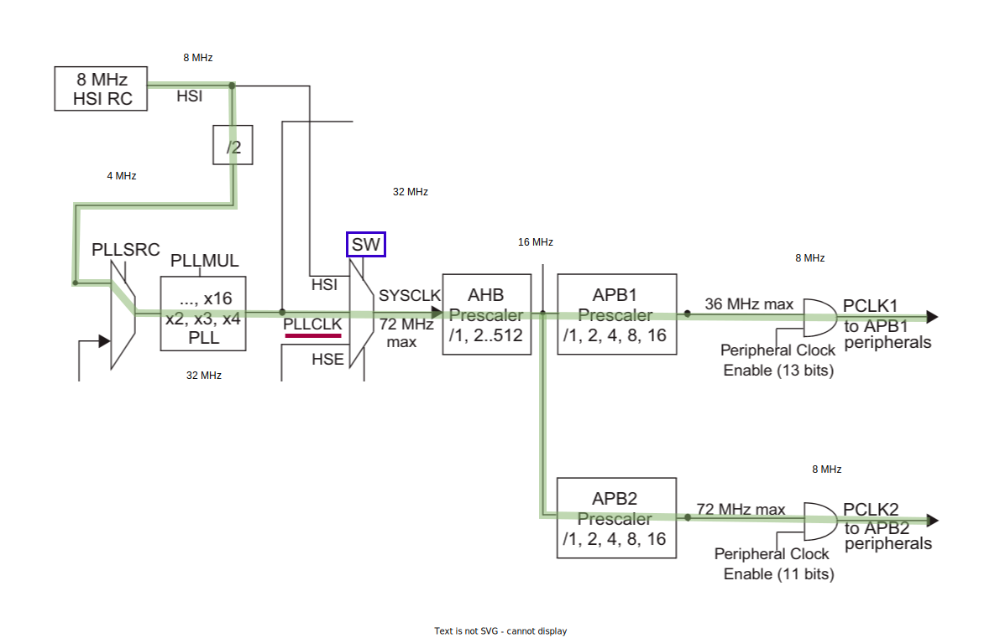
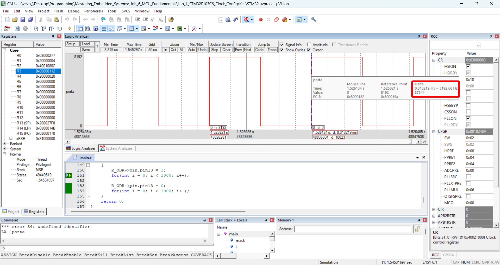

# Clock Tree

  

# Clock Configuration
* The Board is Configured to run With :
  - APB1 Bus frequency = 8 MHz
  - APB2 Bus frequency = 8 MHz 
  - AHB  Bus frequency = 16 MHz
  - SysClk frequency = 32 MHz
  - Only use Internal RC HSI Oscillator

  

## Simulation 

  

  

  

  

