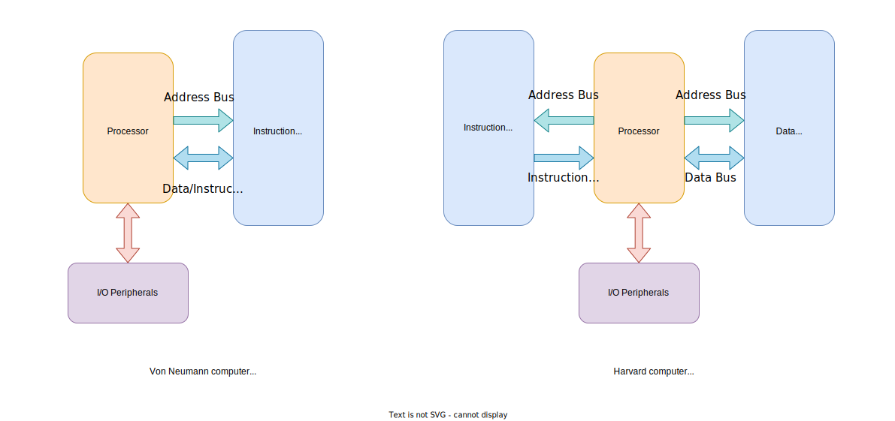

## Harvard Architecture and Von Neumann Architecture

* There are two types of computer architecture, Von Neumann architecture, and Harvard architecture

* In the **Von Neumann architecture**, data and instructions share the same physical memory.
    * There are only one memory address bus and one data transmission bus

* In the **Harvard architecture**, the instruction memory and data memory are two physically separate memory devices. 
    * There are two sets of data transmission buses and memory address buses.
    * When a program starts, the processor copies at least the read-write data section and the zero-initialized data section in the binary executable to the data memory.
    * Copying the read-only data section to the data memory is optional.
    * The text section usually stays in the non-volatile storage. 
    * When the program runs, the instruction stream and the data stream transfer information on separate sets of data and address buses.

  

* In the Harvard architecture, the instruction memory and the data memory are often small enough to fit in the same address space.
    * For a 32-bit processor, the memory address has 32 bits, Modern computers are byte-addressable (i.e., each memory address identifies a byte in memory).
    * When the memory address has 32 bits, the total addressable memory space includes $2^{32}$ bytes (i.e., 4 GB).

* Because the data and instruction memory are small enough to fit in the same 32-bit memory address space, they often share the memory address bus.
    * The processor also maps the registers and memory of all peripherals to the same memory address space of the instruction and data memory. 

* Each type of computer architecture has its advantages and disadvantages.
* The Von Neumann architecture is relatively inexpensive and simple.
* The Harvard architecture allows the processor to access the data memory and the instruction memory concurrently.
    * By contrast, the Von Neumann architecture allows only one memory access at any time instant; the processor either read an instruction from the instruction memory or accesses data in the data memory.
    * Accordingly, the Harvard architecture often offers faster processing speed at the same clock rate.
* The Harvard architecture tends to be more energy efficient. Under the same performance requirement, the Harvard architecture often needs lower clock speeds, resulting in a lower power consumption rate.
* In the Harvard architecture, the data bus and the instruction bus may have different widths. For example, digital signal processing processors can leverage this feature to make the instruction bus wider to reduce the number of clock cycles
required to load an instruction.

---
The core processor communicates with the flash memory (typically used as
instruction memory), SRAM (generally used as data memory), Direct Memory
Access (DMA) controller, and general-purpose input/output (GPIO) ports via a
bus matrix (also called crossbar switch).
•
The bus matrix is an interconnection scheme, which allows concurrent data
streams between components connected to the bus matrix, thus providing a high
communication bandwidth. The bus matrix connects high-speed components,
such as the processor core, Flash, SRAM, DMA controllers, and GPIO ports.
•
Peripheral devices are connected to the bus matrix via the bus bridges that links
the advanced high-performance bus (AHB) and the advanced peripheral bus (APB). Generally, AHB is for high-bandwidth communication, and APB is for
low-bandwidth communication. AHB and APB are connected via bridges, which
buffers data and control signals to fill the bandwidth gap between these two
buses, and ensure that there is no data loss.

Each GPIO pin has multiple functions usually. Software can change its function,
even at runtime. We can use a pin simply for digital input or digital output, or we
can use it for more advanced functions such as analog-to-digital conversion
(ADC), serial communication, timer functions, and so on. Different SoC chips
may have different GPIO functions, depending on the chip manufacturers.
•
Most peripheral components, such as timers, ADC and I2C, are connected to APB.

---

* A bus is a set of physical wires for transferring data or control
signals between two or more hardware components. A
communication protocol or agreement must be in place to
coordinate the use of a bus. The bandwidth of a bus depends on the
width of the bus (usually specified in bits) and the clock speed
supported. A processor has various buses for communicating
c
internal and external hardware components. A bus bridge connects two different buses
together.

  

  

# MCU Clocks

  

