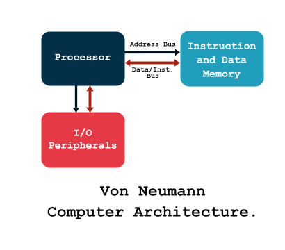
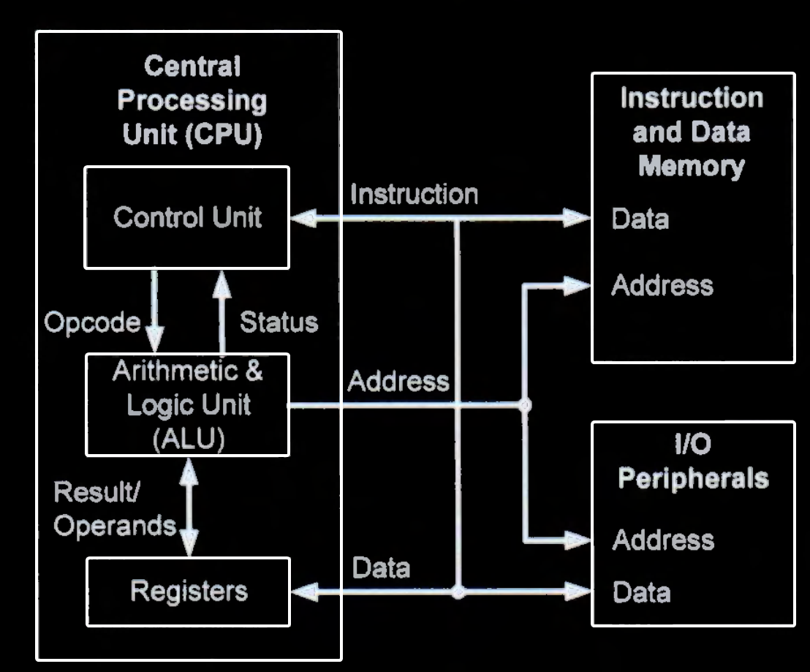
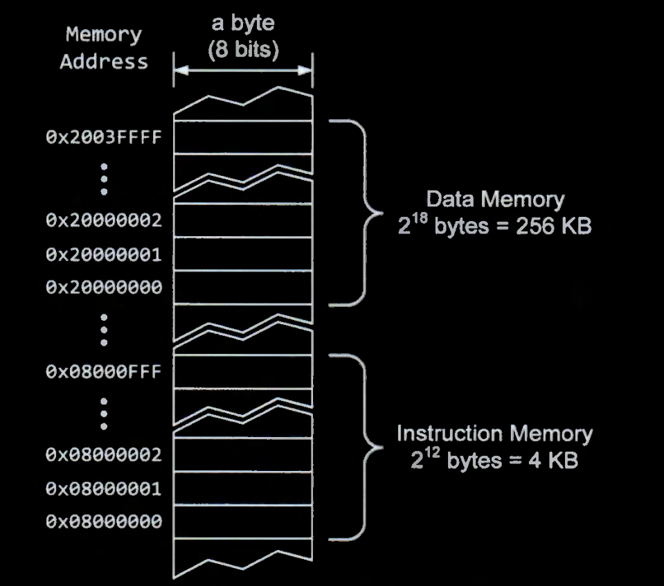
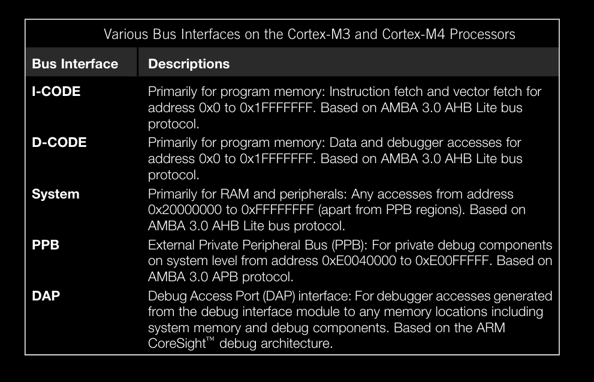
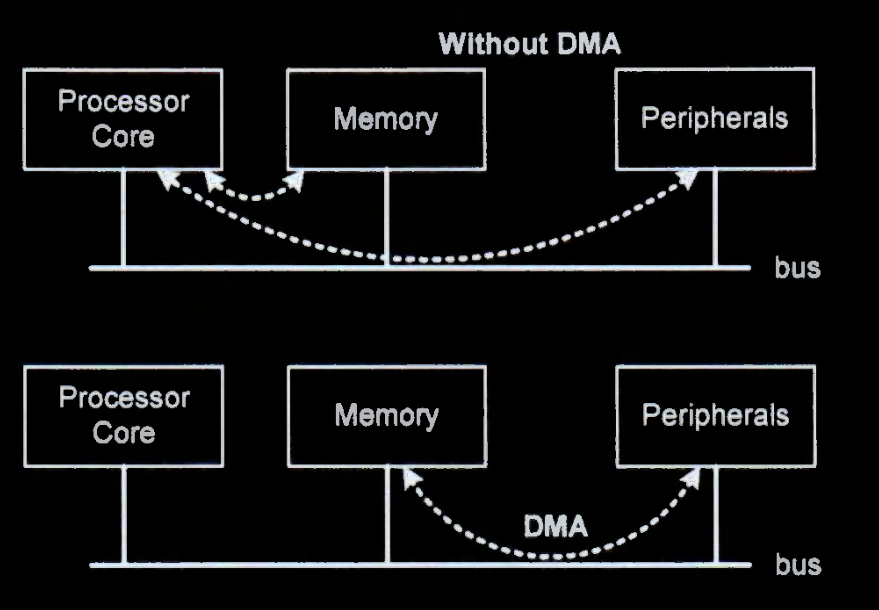
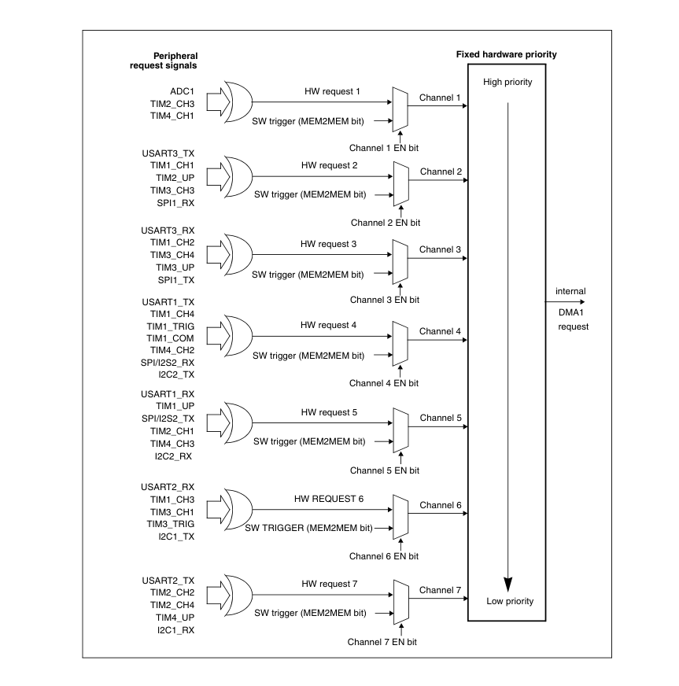
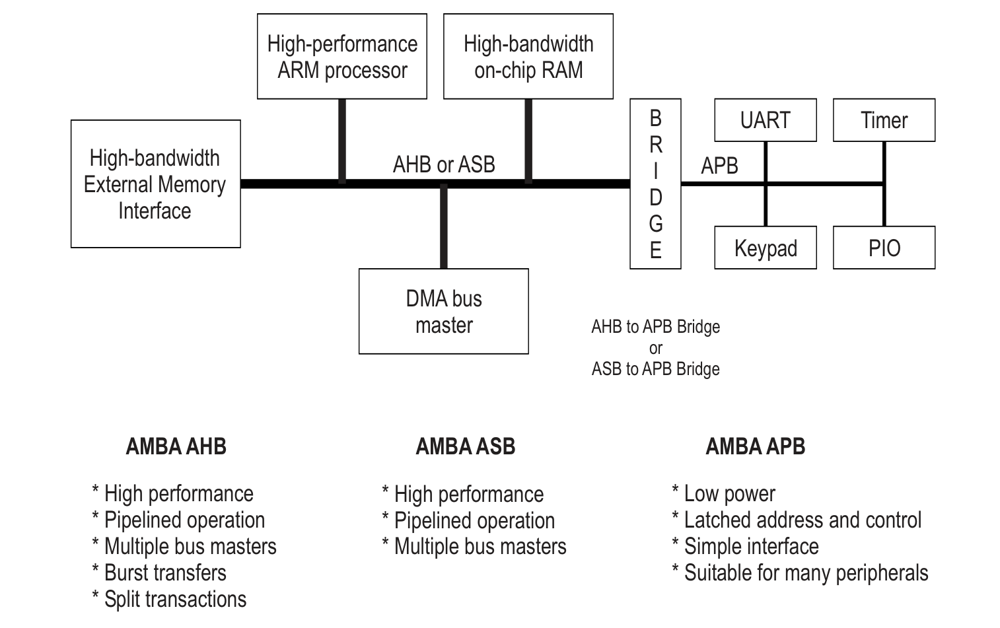

## Harvard Architecture and Von Neumann Architecture

* There are two fundamental types of computer architecture :
    * Von Neumann architecture
    * Harvard architecture

  

* In the **Von Neumann architecture**, data and instructions share the same physical memory.
    * There are only one memory address bus and one data transmission bus

* The heart of the von Neumann computer architecture is the Central Processing Unit (CPU), consisting of the:
    * **Control Unit :** generates control signals for internal digital circuits and coordinates all components of the processor core.
    * **The Arithmetic and Logic Unit (ALU) :** carries out logical (such as logic `AND`), and integer arithmetic operations (such as `ADD`).
* The CPU interacts with a memory and input/output (I/O) subsystem and executes a stream of instructions (the computer program) that process the data stored in memory and perform I/O operations
* The **key concept** of the von Neumann architecture is that data and instructions are stored in the memory system in exactly the same way
    * Thus, the memory content is defined entirely by how it is interpreted

  

### Instruction Set Architecture (ISA)
* A variety of instructions can be executed for moving and modifying data, and for controlling which instructions to execute next.
* This entire group of commands that the CPU understands and can react to is called the **instruction set**.
* The instruction set together with the resources needed for their execution is called the **instruction set architecture (ISA)** 
* The instruction execution is driven by a periodic clock signal Although several substeps have to be performed for the execution of each instruction.
    * sophisticated CPU implementation technologies exist that can overlap these steps such that ideally, one instruction can be executed per clock cycle

### Instruction Execution Procedure
* First, **Fetch** the next instruction to be executed whose address is in the program counter `PC` from the memory and store it in the Instruction Register `IR` in the CPU.
* Increment the value stored in the `PC` to point to the next instruction in the sequence of instructions to be executed.
* **Decode** the instruction in the `IR` to determine the operation to be performed and the addressing mode of the operands.
* Calculate any address values needed to determine the locations of the source operands and the address of the destination.
* Read the values of the source operands 
* Perform operation specified by the opcode.
* Store the results in the destination location.
* Repeat for each instruction in the list.

### CPU Performance Calculations
* The time at which each of the previous micro-operation can execute is coordinated by a periodic signal called the **CPUs clock**, Each micro-operation requires one clock period to execute.
* The time required to execute the slowest of these micro-operations determines, the minimum period of this clock. which is referred to as the **CPU's cycle time**.
* An instruction that requires all seven of these microoperations to be executed will take seven clock cycles to complete from the time it is fetched to the time its final result is stored in the destination location.
    * Thus, the combination of the number of microoperations to be executed for each instruction, the mix of instructions executed by a program. and the cycle time determine the overall performance of the CPU

  

---

* In the **Harvard architecture**, the instruction memory and data memory are two physically separate memory devices. 
    * There are two sets of data transmission buses and memory address buses.
    * When a program starts, the processor copies at least the read-write data section and the zero-initialized data section in the binary executable to the data memory.
    * Copying the read-only data section to the data memory is optional.
    * The text section usually stays in the non-volatile storage. 
    * When the program runs, the instruction stream and the data stream transfer information on separate sets of data and address buses.

* The primary advantage of the Harvard architecture is that it provides two
separate paths between the processor and the memory.
    * This separation allows both an instruction and a data value to be transferred
simultaneously from the memory to the processor.

  

* In the Harvard architecture, the instruction memory and the data memory are often small enough to fit in the same address space.
    * For a 32-bit processor, the memory address has 32 bits, Modern computers are byte-addressable (i.e., each memory address identifies a byte in memory).
    * When the memory address has 32 bits, the total addressable memory space includes $2^{32}$ bytes (i.e., 4 GB).

* Because the data and instruction memory are small enough to fit in the same 32-bit memory address space, they often share the memory address bus.
    * The processor also maps the registers and memory of all peripherals to the same memory address space of the instruction and data memory. 

* Each type of computer architecture has its advantages and disadvantages.
* The Von Neumann architecture is relatively inexpensive and simple.
* The Harvard architecture allows the processor to access the data memory and the instruction memory concurrently.
    * By contrast, the Von Neumann architecture allows only one memory access at any time instant; the processor either read an instruction from the instruction memory or accesses data in the data memory.
    * Accordingly, the Harvard architecture often offers faster processing speed at the same clock rate.
* The Harvard architecture tends to be more energy efficient. Under the same performance requirement, the Harvard architecture often needs lower clock speeds, resulting in a lower power consumption rate.
* In the Harvard architecture, the data bus and the instruction bus may have different widths. For example, digital signal processing processors can leverage this feature to make the instruction bus wider to reduce the number of clock cycles
required to load an instruction.

* ARM Cortex-M3/M4/M7 microprocessors are Harvard
computer architecture, and the instruction memory (flash memory) and data memory (SRAM) are two seperate and isolated memories

* Separating the instruction and data memories allows concurrent accesses
to instructions and data, thus improving the memory bandwidth and speeding up the
processor performance.
Typically, the instruction memory uses a slow but non-volatile flash memory, and the data memory uses a fast but volatile SRAM

* The processor maps the registers and memory of all peripherals to the same memory
address space of the instruction and data memory.

  

* Cortex-M
cores have two separated bus lines for the access to the flash (one for the fetch of instructions called
instruction bus, or simply I-Bus or even I-Code, and one for the access to const data called data bus,
or simply D-Bus or even D-Code) and one dedicated line for the access to SRAM and peripherals
(also called system bus, or simply S-Bus). 

* Instructions are fetched from flash ROM using the ICode bus
* DCode bus Read constant data from ROM
* System bus Read/write data from RAM or Peripherals
    * Data are exchanged with memory and Peripherals via the system bus interface

  

### Modern CPUS

* A typical Harvard architecture processor that includes internal memory includes two separate memories, one for data, and one for program instructions. 
In order to expand the memory capacity of Such a processor, memory external to the processor must be added.
* However, Since a Harvard architecture processor has two separate memories, in order to expand both data memory and program instruction memory, two Separate external memories must be added. This is a Significant disadvantage when low-cost Systems are being built.
* Some conventional processors provide the capability to
access data that is Stored in program instruction memory
using special instructions, but this is a limited Solution.

* Most current general purpose CPUs use Modified Harvard Architecture.
    *  that provides the processing Speed advantages of the Harvard architecture, but does not require Special purpose instructions or two Separate external memories in order to expand both data memory and program instruction memory.
* If you look at the L1 caches you would see that in AMD, ARM and Intel systems you have Instruction L1 Cache and Data L1 Cache, that can be accessed independently and in parallel. That's the Harvard part. However, in L2, L3 or in DRAM, data and codes are mixed. That's the Von Neumann part.

So why isn't a pure Harvard architecture adopted for PC's? My opinion is that it does not make sense. If you profile main majority of applications, you would see that the L1 Instruction Cache miss ratio is very small. This means that generally code size is not a problem. So it wouldn't make sense to design a fully separate path for code. Data can grow very large but code can't really.

* Modern general-purpose high-performance processors use separate instruction and data caches, and so could be classified as modified Harvard even though they use a unified address space.

---
The core processor communicates with the flash memory (typically used as
instruction memory), SRAM (generally used as data memory), Direct Memory
Access (DMA) controller, and general-purpose input/output (GPIO) ports via a
bus matrix (also called crossbar switch).
•
The bus matrix is an interconnection scheme, which allows concurrent data
streams between components connected to the bus matrix, thus providing a high
communication bandwidth. The bus matrix connects high-speed components,
such as the processor core, Flash, SRAM, DMA controllers, and GPIO ports.
•
Peripheral devices are connected to the bus matrix via the bus bridges that links
the advanced high-performance bus (AHB) and the advanced peripheral bus (APB). Generally, AHB is for high-bandwidth communication, and APB is for
low-bandwidth communication. AHB and APB are connected via bridges, which
buffers data and control signals to fill the bandwidth gap between these two
buses, and ensure that there is no data loss.

Each GPIO pin has multiple functions usually. Software can change its function,
even at runtime. We can use a pin simply for digital input or digital output, or we
can use it for more advanced functions such as analog-to-digital conversion
(ADC), serial communication, timer functions, and so on. Different SoC chips
may have different GPIO functions, depending on the chip manufacturers.
•
Most peripheral components, such as timers, ADC and I2C, are connected to APB.

---
## DMA
* Direct memory access (DMA) is a useful technique for transferring data between peripherals and memory, or between memory and memory, without using many processor cycles.
    * The processor needs to program the DMA controller and send a command to start the DMA transfer.
    * However, during the transfer process, the processor is not involved and can execute other tasks. 
* For slow peripherals, DMA releases the processor from waiting for peripheral data and allows the CPU to serve other tasks.
* For fast peripherals, DMA improves the data transfer throughput because memory accesses take place without the involvement of the processor.
* For high-speed peripherals, DMA can help significantly reduce the rate at which interrupts are generated. Thus, DMA decreases the performance overhead from interrupts.

* With DMA support, a peripheral does not need to have local buffer memory to store data. Instead, data can be efficiently stored in data memory via DMA. 

* DMA controllers reside on the AHB bus. A DMA controller acts as a bus master and a
bus slave. It has two ports. The slave port can accept data and commands from the
processor when the processor sets up DMA transfers. The master port can initiate data
transfer within the AHB bus or across the AHB/APB bridge. A DMA controller often
manages multiple channels that can be programmed independently. While all channels
of a DMA controller share the same interface to the AHB bus, each channel has its own
dedicated interface to peripherals. Thus, multiple channels can perform DMA transfers
simultaneously.

* DMA transfers can be either flow-through or fly-by:
    * A flow-through (or fetch-and-deposit) DMA transfer involves two steps:
        * data are read one at a time from the source into a register in the DMA controller
        * data are written to the destination.
    * A fly-by DMA transfer only requires one bus transfer. 
        * Data are directly transferred from the source to the destination without being read into the DMA controller.
* The DMA controllers on STM32L processors use flow-through transfers.

### Without vs With DMA

* Without DMA, the processor is fully occupied during the data transfer. It needs to
perform two operations explicitly to read data from a peripheral. The first operation is a
load instruction that copies a peripheral data register to a register in the processor core.
The second operation is a store instruction that saves data to memory.
Similarly, the processor must perform a load and a store operation to write data to a
peripheral. The processor reads the data from memory and writes the data to the
peripheral.
Furthermore, without DMA, the processor uses either busy-waiting or interrupt methods
to make sure that the peripheral' s data register is ready to read or write. The busy-waiting
method is simple but inefficient because it prevents the processor from performing other
tasks. The interrupt approach is more efficient than busy-waiting. However, it is not
suitable for high-speed peripherals because high-frequency interrupts can create a large
performance overhead.

On the contrary, if DMA is used, data exchange between memory and peripherals, or
between two different memory regions, occurs without processor intervention. The
processor only needs to set up the DMA transfers by programming the DMA controller
and start the transfer by enabling the DMA channel. Once the transfer is in progress, the
processor becomes available for other tasks.
For example, after the processor configures and initiates the DMA channel that responds
to the USARTl receive register not empty (RXNE) events, the OMA engine copies data in the
USARTl RX register to memory as soon as it is received.
•
The "write to" and "read from" operations are offloaded from the processor core
to the DMA controller.
•
The DMA engine uses flow-through transfers. Each DMA transfer still takes two
bus transfers to move data from USARTl to memory. Although OMA does not
reduce the total latency of these two data transfers, this latency can be hidden
from the processor.
•
The OMA controller can generate an interrupt at the end of each OMA transfer
sequence to inform the processor that data has been saved to memory and is
ready to be processed

In this way, OMA allows data computation and data transfer to take place in parallel,
leading to performance improvement. DMA may stop the processor's access to the AHB
bus for a short time if both are trying to access the same destination (memory or
peripherals) at the same time.

## DMA Channel

* STM32 DMA controller for example, has seven channels. 
    * Each channel can perform DMA transfers independently.
    * Each channel has its own source, destination, transfer direction, transfer width, data amount, and trigger.
* If a DMA channel is enabled, it performs a DMA transfer automatically for each trigger received. 

* Each channel can be programmed to be triggered by one event selected among events available to that channel.

* Each channel has a software priority and a hardware priority. When multiple channels
are active, the DMA controller uses the priority level to determine the order of bus access
when a bus resource conflict occurs. If two or more DMA channels have the same
software priority level, the DMA controller uses the hardware priority to break the tie.

* Software priority. Programs can configure the software priority of each channel.
When multiple channels are used, software should give a high priority to a
channel that requires a high bandwidth, to achieve continuous data transfers and
provide sustained data rates. There are four levels of priority, including very high
(0b11), high (0b10), medium (0b01), and low (0b00).
•
Hardware priority. On STM32L4 processors, channel 1 has the highest hardware
priority, and channel 7 has the lowest. Users cannot change the hardware priority
of OMA channels. When multiple channels have the same software priority, the
DMA engine uses their hardware priority to arbitrate the bus accesses.

* Each DMA channel has four registers:
    * the channel memory address register (CMAR) :  specify the
starting address of the data memory
    * the channel peripheral address register (CPAR) : specify the starting address of the peripheral
    * the channel number of data register (CNDTR) : Specify the total number of data to transfer
    * the channel configuration register (CCR) 

* Increment mode determines whether CPAR or CMAR increments after each OMA transfer,
(see Figure 19-8). This mode can be programmed separately for CPAR and CMAR. For
example, if increment mode for CMAR is enabled and MSIZE is four bytes, then the memory
address stored in CMAR automatically increments by four after each DMA transfer.

*

---

* A bus is a set of physical wires for transferring data or control
signals between two or more hardware components. A
communication protocol or agreement must be in place to
coordinate the use of a bus. The bandwidth of a bus depends on the
width of the bus (usually specified in bits) and the clock speed
supported. A processor has various buses for communicating
c
internal and external hardware components. A bus bridge connects two different buses
together.

  

The Advanced Microcontroller Bus Architecture (AMBA) is an open on-chip
communication standard for embedded microcontrollers. Chip designers can use AMBA
without paying royalties. AMBA was first introduced by ARM in 1996. AMBA 2.0,
released in 1999, specifies the architecture and communication protocol of three bus
standards, including the Advanced High-performance Bus (AHB), the Advanced System
Bus (ASB), and the Advanced Peripheral Bus (APB). 

*  Each bus architecture provides a
set of separate communication paths to transfer data, instructions, and control signals.
AMBA deploys a master/slave communication model in which only a master can control
the bus and initiate data transfer.

* The AHB or ASB is the backbone bus that has high-performance and high clock frequency.
* It supports pipelined operation to achieve high bandwidth, burst transfers to reduce the latency of bus access arbitration, and multiple bus masters
to allow several components to initiate data transfer. Bus arbitration refers to the
process of deciding which bus master will be allowed to control the bus when
there are multiple masters. AHB supports wider data transfer and has a higher
bandwidth than ASB. AHB is used on ARM Cortex-M microprocessors.

* The APB is a simple, low-power, and low-bandwidth bus that is suitable for low-
speed peripherals such as timers, USART, SPI, and LCD. These peripherals
typically use memory-mapped registers to provide a simplified interface. Unlike
AHB, communications in APB are not pipelined. All peripherals on the APB bus
can only act in the role of a slave, which cannot initiate a transfer.

* The AHB bus is connected to a bus matrix. The matrix uses a priority-based round-robin
scheduling algorithm to ensure that no modules can block the data transmission of the
other modules for a long time. The bus matrix also arbitrates any conflicts when multiple
accesses are attempted simultaneously.

* A bridge is required to connect the AHB and APB buses. The bridge allows a master on
the AHB bus to communicate with a peripheral device on the APB bus, even though they
use different communication protocols. The bridge acts as the only master on the APB
bus and as a slave on the AHB bus. Due to the speed gap between AHB and APB, the
bridge buffers addresses, controls and data from AHB to ensure that there is no data loss
during the communications. The bridge also drives the APB peripherals and provides
response signals to the AHB.

---

  

# MCU Clocks

  

