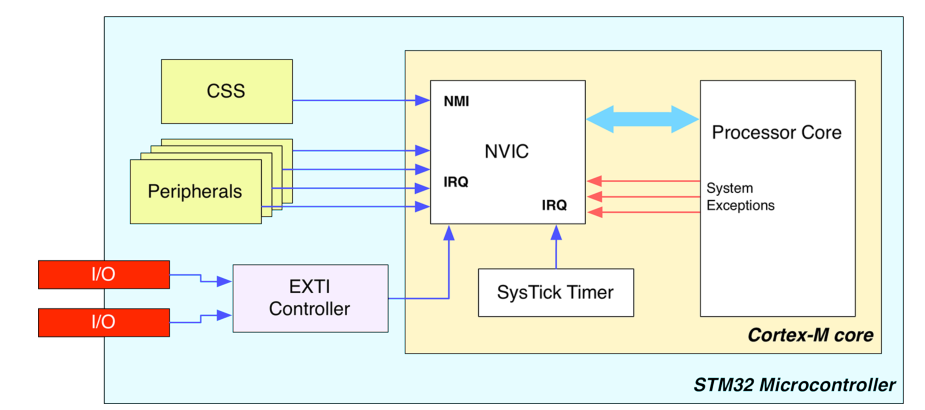
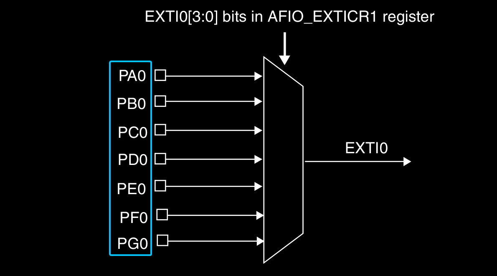
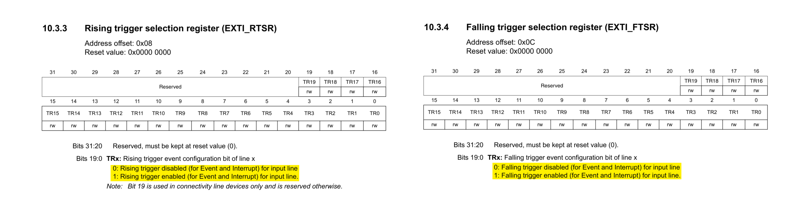
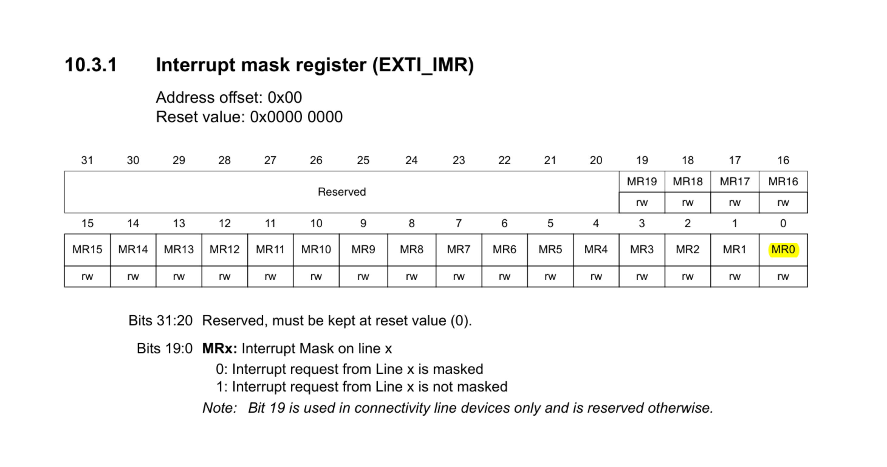
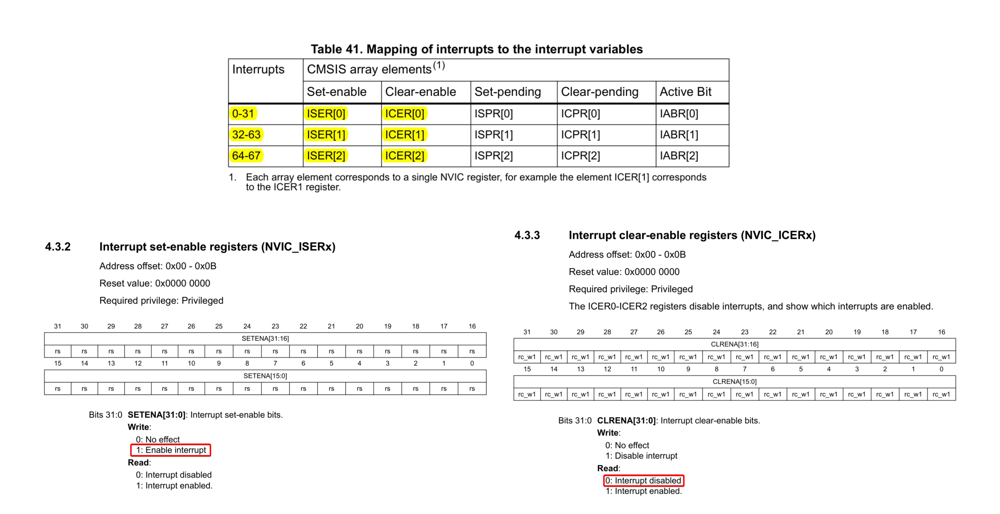

# External Interrupts (EXTI)

* External interrupts are interrupts triggered by peripherals or devices, external to the microprocessor core allowing the microcontroller to monitor external signals efficiently and promptly response to external events.

<p align="center">
  
</p>

* **Clock Security System (CSS):** is a self diagnostic peripheral that detects the failure of the external clock, called HSE.
    * If this happens, HSE is automatically disabled (this means that the internal HSI is automatically enabled) and an NMI interrupt is raised to inform the software that something is wrong with the HSE.

* The external interrupt controller supports 16 external interrupts, named `EXTI0`, `EXTI1`, ... , `EXTI15`.
    * Each of these interrupts is only associated with one specific GPIO pin.

* The GPIO pins with the same pin number in all GPIO ports are assigned to the same external interrupt

<p align="center">
  
</p>

---

## Software Configuration Steps

1. Set up the external interrupt configuration register `EXTICR` to map the GPIO pin n to the external interrupt input line n.

<p align="center">
  
</p>


2. Select the active edge that can trigger EXTI n, The signal can be a rising edge, a falling edge or both. 

<p align="center">
  
</p>

3. Enable EXTI n by setting the kth bit in EXTI interrupt mask register `EXTI_IMR`

<p align="center">
  
</p>

4. Enable interrupt EXTI n on NVIC controller.

<p align="center">
  
</p>

<p align="center">
  
</p>

5. Write the interrupt handler for EXTI n.

```arm
.word EXTI0_IRQHandler
.word EXTI1_IRQHandler
.word EXTI2_IRQHandler
.word EXTI3_IRQHandler
.word EXTI4_IRQHandler
.word EXTI9_5_IRQHandler
.word EXTI15_10_IRQHandler
```

6. In the interrupt handler, software needs to clear the corresponding pending bit to
indicate the current request has been handled.

<p align="center">
  
</p>
