# GPIO

  

# Output Configuration
## Push-Pull Mode

  

## Open Drain Mode

  

# Input Configuration

  

## Floating state Input Mode
* Whenever the microcontroller is powered ON, the GPIO pins are by default in this HIGH impedance state input mode. 
* You only want to configure a pin as floating if you know it will be driven externally. 
* Otherwise, It is recommended to keep the unused pins in either a pull-up or pull-down state to avoid leakage of current.

  

## Shmitt triggered input

* A Schmitt trigger is a voltage comparator that turns ON only when the input voltage gets pass an upper threshold and once running it will turn OFF only when the input voltage goes below the lower threshold.
* a Schmitt triggered input is useful in noisy environments.

  

---

## Case Study : STM32

  

  

