## IO Electrical Characteristics

  

  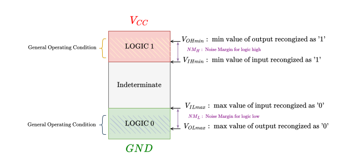

---
# Serial Communication
* Serial communication transfers a single bit each time and uses either a single wire for each communication direction or a shared wire for both directions.

## Universal Asynchronous Receiver and Transmitter (UART)

* The keyword "universal" means the serial interface is programmable. 
* The asynchronous transmission allows bits to be transmitted in a serial fashion without requiring the sender to provide a clock signal to the receiver (it can be configured to communicate synchronously, which is then called USART).
    * However, both senders and receivers must agree on the data transmission rate before the communication starts.
    * The sender and the receiver should use the same baud rate to set up the clock agreement.
*  In digital systems, the baud rate is the bit rate, i.e., the number of bits transmitted per second.
    * In some analog systems, such as modems, the baud rate is larger than the corresponding bit rate when there are more than two voltage levels and a voltage signal transmitted can represent multiple bits.

* With full-duplex communication, data is always transmitted out bit by bit from
the TX line and is received by the other device on its RX line. The receiver
reassembles bits received into bytes.

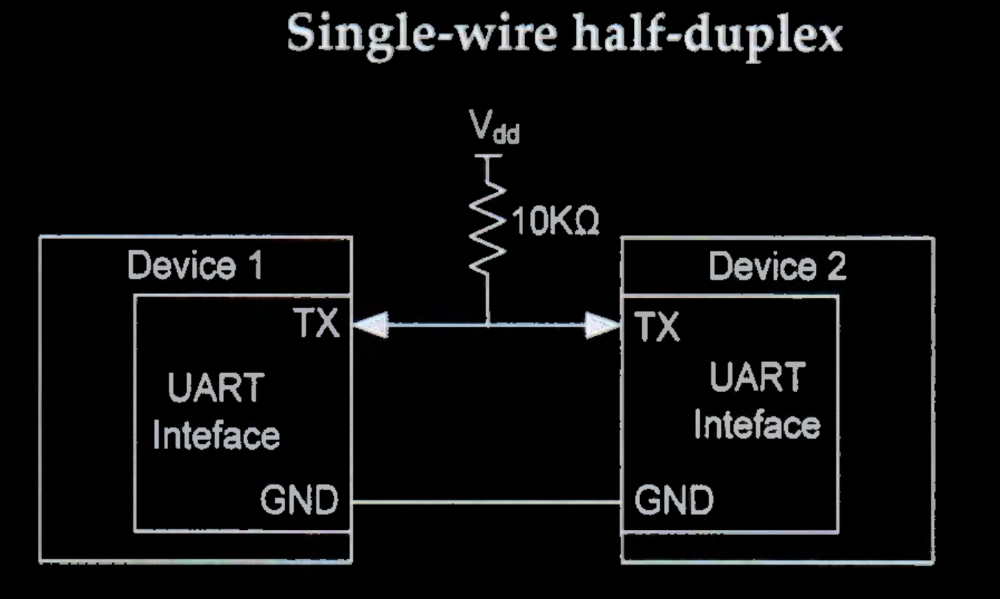

* With the single-wire half-duplex communication, TX and RX are internally
connected, and only one wire is used. TX is used for both sending and receiving
data. In this mode, TX pins are pulled up externally because these two pins must
be configured as open-drain.

### Frame

* A frame is the smallest unit of
communication.

* In a frame:
    * The data length (7, 8, or 9 bits)
    * The parity bit (even, odd, or no parity)
    * The number of stop bits (0.5, 1, 1.5, or 2 bits)
    * The data order (MSB or LSB first) are configurable

* Each frame begins with a start bit, represented by a low-level voltage.
* After the start bit, the individual bits of each frame are shifted out of one UART interface and into another.

* When the sender sends a frame, the sender can optionally calculate the parity of this frame and send the parity bit to the receiver for error checking.
    *  Even parity. The combination of data bits and the parity bit contains an even number of 1s.
    * Odd parity. The total number of l s in the data bits and the parity bit is an odd number.

* Each frame ends with a stop bit, represented by a high voltage. If no further data is transmitted, the voltage of the transmission line remains high.
    * The number of stop bit in each frame is usually one by default.
    * If the receiver does not obtain the stop bit, the current frame is considered corrupted and discarded.

## Oversampling

* As the transmitter and receiver clocks are independent of each other, oversampling is an
effective approach to mitigate the effects of clock deviation and avoid corruption by high-
frequency noise. The most commonly used sampling rate is 8 or 16 times the baud rate.
* The receiver samples each bit 8 or 16 times and uses
these values to estimate the middle of each bit pulse, resulting in a more reliable and
robust transmission link.

## Baud Rate

Historically the baud rate was used in telecommunications to represent the number of pulses or transitions physically transferred per second.
* By using phase shift and other technologies, a pulse on phone lines can represent multiple binary bits, resulting in a bit rate larger than the baud rate.
* In digital communication systems, because each pulse represents a single bit, the baud rate is the number of bits physically transferred per second, including the actual data content and the protocol overhead, leading to a bit rate lower than the baud rate.

  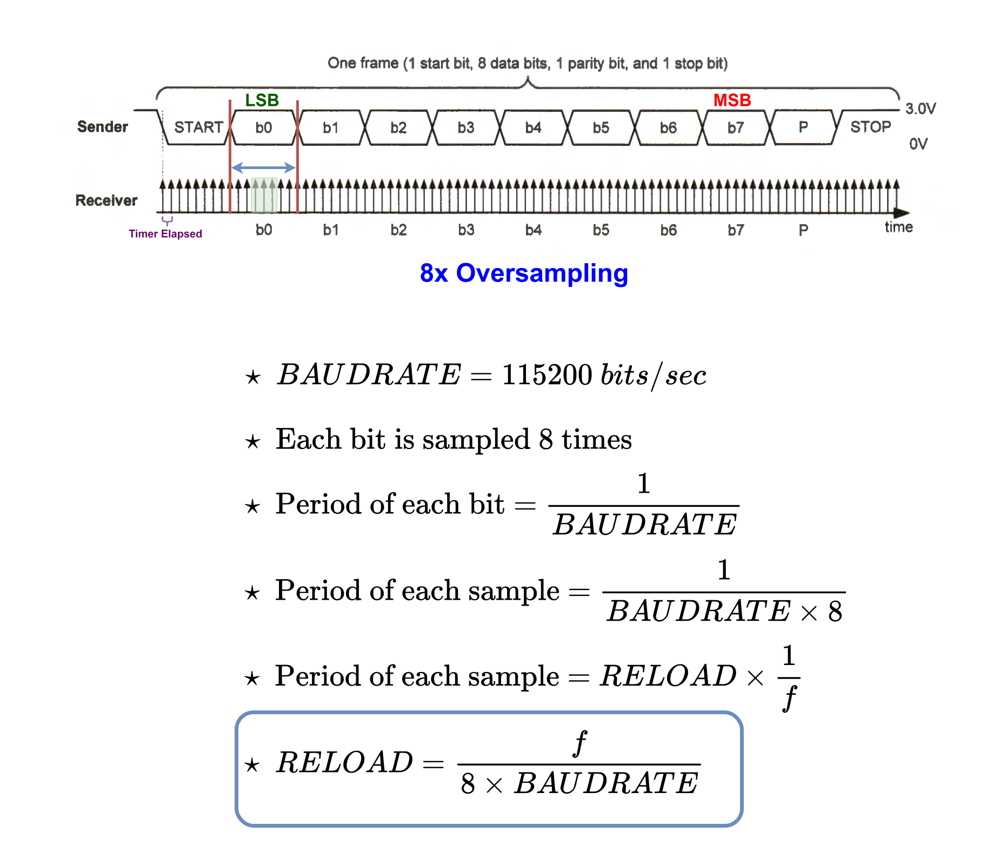

## UART Standards

* Voltage signals for UART are defined in different standards, such as RS-232, RS-422, and RS-485.
* The prefix RS stands for "recommended standard.

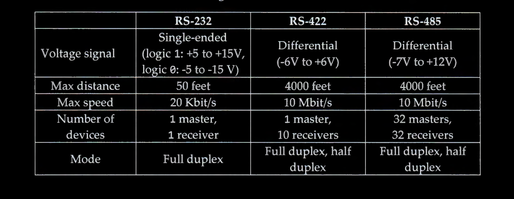

* Differential signaling uses two twisted wires with equal but opposite signals to transmit digital data. 
* Electrical noise can be inducted into the signal wires or can be generated by the voltage difference
between two ground references. 
* Noise is coupled into both wires equally. 
    * Therefore, the noise can be canceled out at the receiver. 

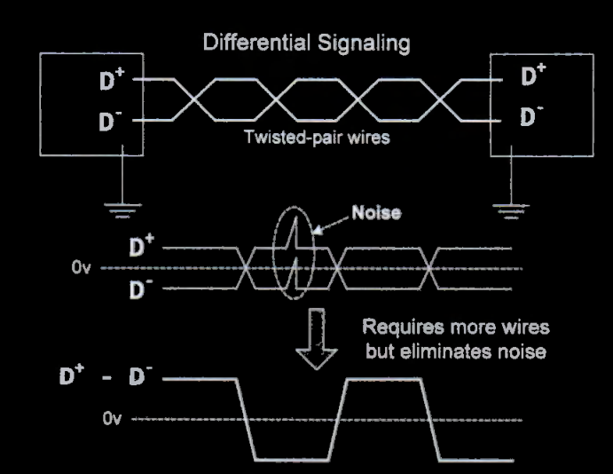

--- 

## Serial Pripheral Interface (SPI)

* Serial peripheral interface (SPI) is a synchronous serial communication interface widely used to exchange data between a microprocessor and peripheral devices using **four wires**.

* **Advantages :**
    * Simple, frameless.
    * low power requirements.
    * High throughput (1 to 20 megabits per second).
* **Disadvantages :**
    * Support small distances
    * does not support multiple masters
    * Slaves cannot start the communication or control data transfer speed.
    * Master initiates and controls all communications.

* A SPI interface consists of four lines:
    * a master-in-slave-out data line (MISO) : 
    * a master-out- slave-in data line (MOSI) :
    * a serial clock line (SCLK) : 
    * an active-low slave select line (SS) :

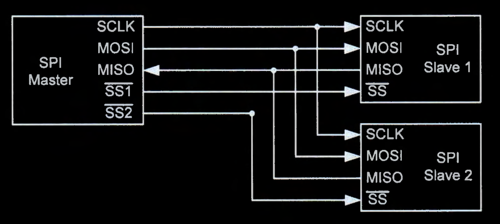

* SPI only supports a single master communicating with multiple slave devices. 
    * when the master wishes to exchange data with a slave, it pulls down the corresponding select line (SSN).
    * The master then generates clock pulses to coordinate the data transmission on the MOSI and MISO lines.

* Data exchange can take place in both directions simultaneously (full duplex)

* When there are multiple slave devices, the master decides which slave device it wants to communicate. 
    * There is a dedicated Slave Select (SS) line for each slave device.
    * The master selects the target slave device by pulling the corresponding SS line to a low voltage prior to data transfer. 
    * The selected slave device then listens for the clock and MOSI signals.

* When there is only one slave device, the SS line can be directly connected to ground
physically, or the program can make the slave continuously selected.

* SPI is a synchronous protocol, and the slave devices must send and receive data based on the clock provided by the master. 
    * The master and a slave perform data exchange at synchronized time steps based on the clock signal generated by the master.

* When a bit is shifted out on the MISO line from the slave's data register during a clock period, a new data bit is shifted into this register from the MOSI line in the same clock period
* When one device writes a bit to the data line at the rising or falling edge of the clock, the other device then reads the bit at the opposite edge of the same clock
period.
* The data transfer size is usually a byte or halfword (16 bits) .

* Communication from the master to a slave and communication from a slave to the master are always taking place concurrently. 
    * In each communication link (either MISO or MOSI), each device sends out a data item and at the same time receives a new data item.
* Therefore, when a slave wants to send data to the master via the MISO line, the slave must wait for the clock signal. At the same time, the master must send some dummy data (commonly r/w bit to indicate whether we are reading or writing) out via the MOSI line to generate the clock signal to initiate the data transfer

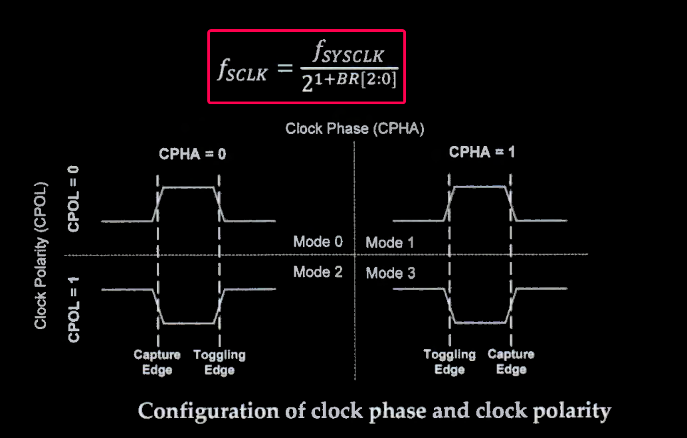

* The clock speed determines the data transfer rate. The data rate ranges from 1 to 20
megabits per second. The master can change the clock speed by programming the clock
prescaler register.

* The combination of CPOL and CPHA selects the clock edge for transmitting and capturing data.
    * Toggling edge : changing the bit to be transmitted
    * Capturing edge : sampling the bit to be transmitted

* Four possible clock modes are available to program the clock edge used for data sampling and data toggling :
    * `CPOL` is 0 : the SCLK line is pulled low during idle time.
    * `CPOL` is 1 : the SCLK line is pulled high during idle.
    * `CPHA` is 0 : the first clock transition (either rising or falling) is the first data capture edge.
    * `CPHA` is 1 : the second clock transition is the first capture edge.

---

## Inter-Integrated Circuit

* Enables the communication between microprocessors and their peripheral devices by using two wires:
    * a serial data line (SDA)
    * a serial clock line (SCL). 
* The two-wire design reduces the number of physical pins, making it inexpensive and simple to interface. 
* The data transfer rate of I2C can be up to 100 Kbit/s in standard mode, up to 400 Kbit/s in fast mode, and up to 3.4 Mbit/s in high-speed mode.

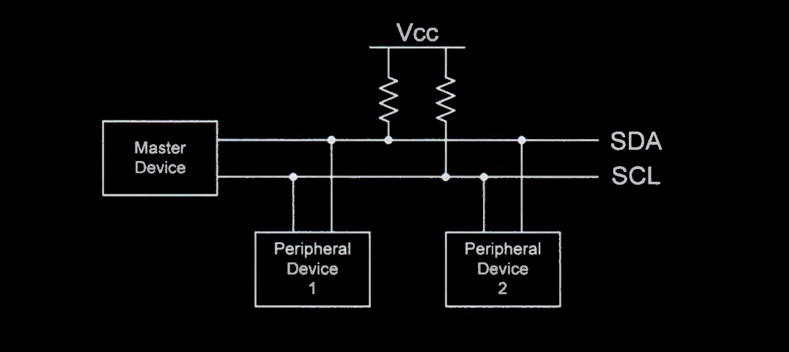

* Each device, including master devices and peripheral devices, has a unique address, which typically has 7 bits, 10 bits, or 16 bits.

* The pins of the master and peripheral devices connected to the SDA and SCL lines should be internally configured as open-drain
    * The output pin connects to a positive voltage source if an active high (logic 1) is outputted.
    * The output pin is in a high impedance state if a low (logic 0) is outputted. 

*  However, the pull-up resistor within the processor is too large, often in the order of 100k ohm.
    * Such a large resistor provides pull-up power that is too weak for I2C.
    * To reduce the rise time of the I2C lines, smaller resistors, such as 3k ohm, are often used.
    * The recommended resistance value is 4.7 k ohm for low speed, 3 k ohm for standard speed, and 1 k ohm for the fast speed.

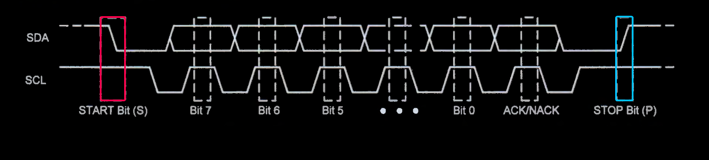

* The communication begins with a START bit (S) and terminates by a STOP bit (P).
    * A START bit is defined as a high-to-low transition of SDA while SCL is high.
    * A STOP bit is defined as a low-to-high transition of SDA while SCL is high.
* After the START bit, the master begins to send data byte by byte. For each byte, the most significant bit is transferred first.
* The slave sends an acknowledge bit to the master after each received byte, informing the master that the slave has successfully received a byte.

* The transmitter releases the SDA line during the acknowledge clock period (the ninth clock period) so that the receiver can pull SDA low.
    * If the SDA line is low in the ninth clock period, an ACK takes place. 
    * If the SDA line is high in the ninth clock period, a scenario we call NACK occurs.

* When a master sends data to a slave, a NACK answered by the slave means that the communication has failed. The master needs to either generate a STOP to abort the current transfer or a START to restart the transfer.

### Master Transmitter format

### Master Receiver format

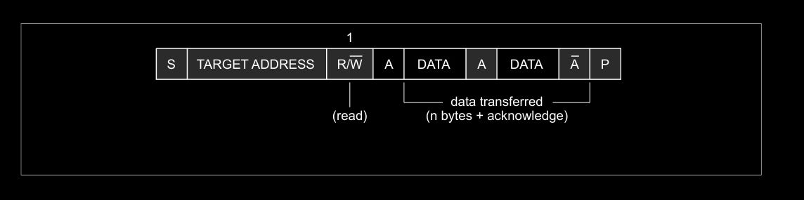

### 10-bit addressing 

### Repeated Start Condition

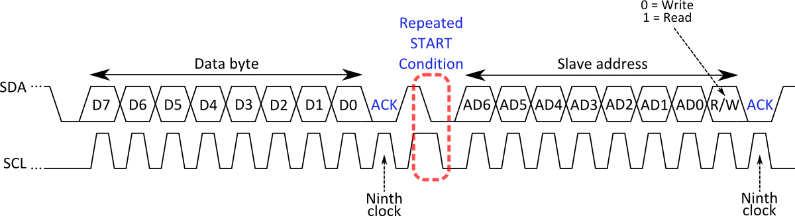

* During an I2C transfer there is often the need to first send a command and then read back an answer right away. 
    * This has to be done without the risk of another (multimaster) device interrupting this atomic operation. 
* The I2C protocol defines a so-called **repeated start condition**. 
* After having sent the address byte (address and read/write bit) the master may send any number of bytes followed by a stop condition.
* Instead of sending the stop condition it is also allowed to send another start condition again followed by an address (and of course including a read/write bit) and more data. 
    * This is defined recursively allowing any number of start conditions to be sent.
* The purpose of this is to allow combined write/read operations to one or more devices without releasing the bus and thus with the guarantee that the operation is not interrupted.
    * Regardless of the number of start conditions sent during one transfer the transfer must be ended by exactly one stop condition.
    