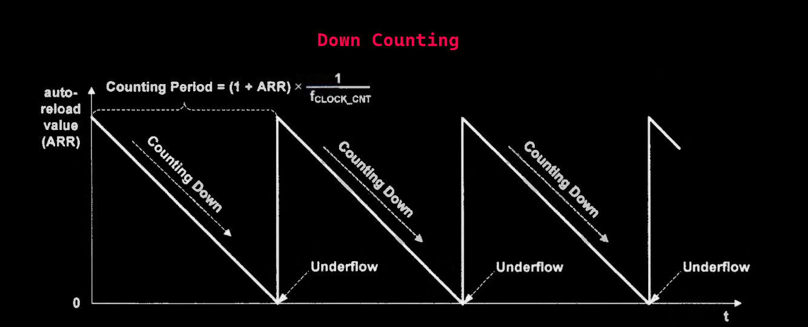
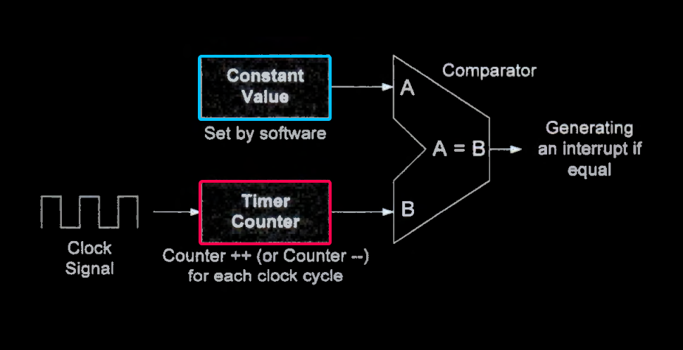
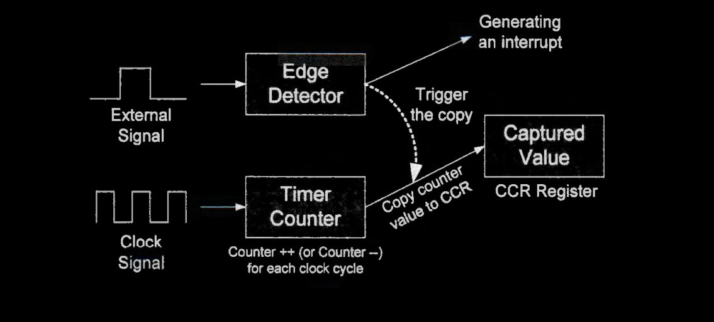
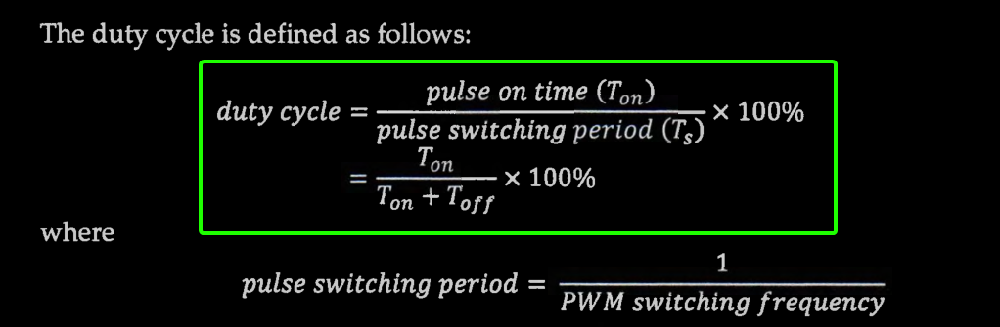
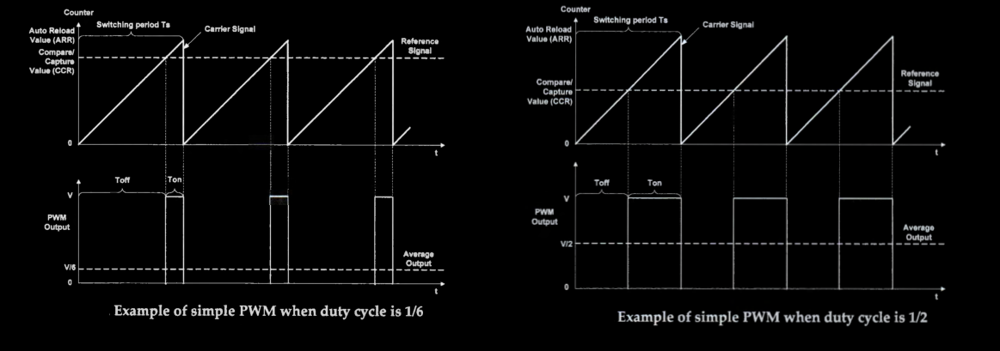
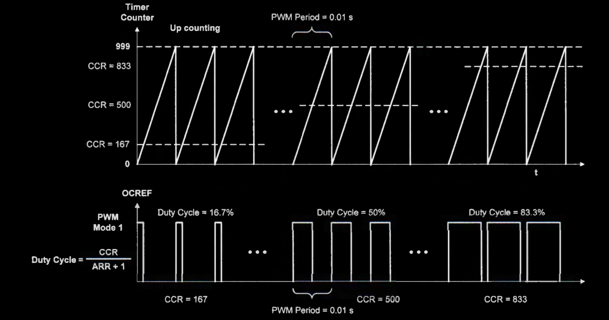

# General-Purpose Timers

* A timer is a free-run hardware counter that increments or decrements once for every clock cycle. 

  

### Output compare mode

* The clock to drive the timer counter (CLOCK_CNT) can be slowed down by a constant factor called prescaler to generate output that spans over a long period.
    * A large prescaler reduces the timer's resolution, but decreases the chance of overflow and underflow and improves the energy efficiency.

* When the timer counter (CNT) equals the compare value (CCR), the output of a channel is programmable depending on the output compare mode (OCM).
    * The active and inactive mode outputs a logic high and logic low, respectively
    * The toggle mode reverses the output  
    * The forced inactive and active mode makes the output stay low and high, respectively.

### Input capture mode

*  the hardware automatically logs the counter value into a special register (called CCR) and generates an interrupt when the desired event occurs.
    * Typically, the interrupt handler needs to copy register CCR to a user buffer to record the timing of past events.

## PWM
* Pulse width modulation (PWM) is a simple digital technique to control the value of an analog variable. PWM uses a rectangular waveform to quickly switch a voltage source on and off to produce a desired average voltage output. Although the output is binary at any time instant, the average output over a time span can be any value between 0 and the maximum voltage.

* Specifically, the percentage of time in the on state within one period is proportional to
the mean value of the voltage output. Consequently, when software changes the duration
of the on state, the output voltage is adjusted accordingly to emulate an analog signal.

